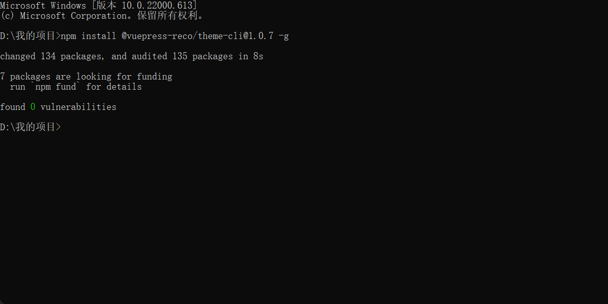
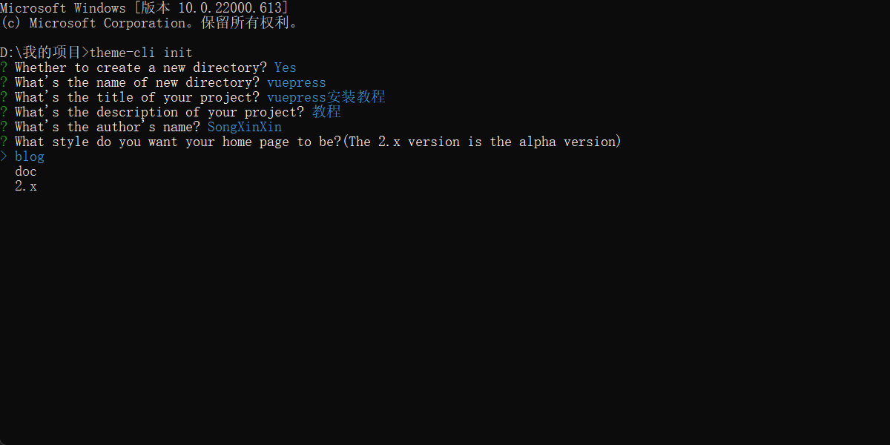
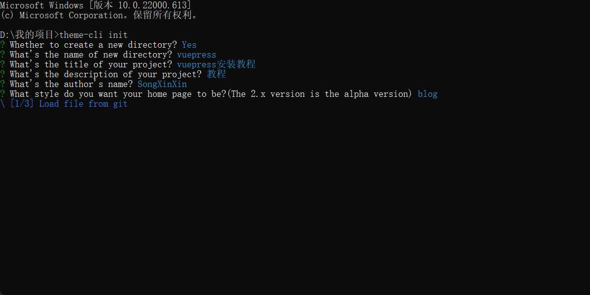

手把手教你使用VuePress搭建自己的个人博客。


<!-- more -->

## VuePress介绍

VuePress 是一个以 Markdown 为中心的静态网站生成器。你可以使用 [Markdown](https://zh.wikipedia.org/wiki/Markdown) 来书写内容（如文档、博客等），然后 VuePress 会帮助你生成一个静态网站来展示它们。

一个 VuePress 站点本质上是一个由 [Vue](https://v3.vuejs.org/) 和 [Vue Router](https://next.router.vuejs.org/) 驱动的单页面应用 (SPA)。

路由会根据你的 Markdown 文件的相对路径来自动生成。每个 Markdown 文件都通过 [markdown-it](https://github.com/markdown-it/markdown-it) 编译为 HTML ，然后将其作为 Vue 组件的模板。因此，你可以在 Markdown 文件中直接使用 Vue 语法，便于你嵌入一些动态内容。

在开发过程中，VuePress会启动一个常规的开发服务器 (dev-server) ，并将 VuePress 站点作为一个常规的 SPA。如果你以前使用过 Vue 的话，你在使用时会感受到非常熟悉的开发体验。

## VuePress-Theme-Reco介绍

`vuepress-theme-reco` 是针对VuePress开发的一款第三方主题，该主题几乎继承 `VuePress` 默认主题的一切功能，并支持通过脚手架快速搭建，虽然该主题现已推出2.x的alpha版本，但鉴于正式版还未推出，本教程将基于该主题的1.x版本进行讲解。

## 快速开始

1. **安装theme-cli脚手架**

   在控制台输入以下命令

   ```node
   npm install @vuepress-reco/theme-cli@1.0.7 -g
   ```

   
2. **初始化项目**

   输入以下命令进行项目初始化

   ```node
   theme-cli init
   ```

   

   提示是否创建文件夹？若创建文件夹，此处可选择'n'，我没有创建故这里选择'y'

   

   提示输入文件夹名称，同上，已创建文件夹的可以直接按回车跳过此步

   之后的操作分别是 标题(首页显示)、描述(首页显示)、作者(首页显示)、选择模板，模板这里我们要选择'blog'，中间的步骤都可以直接按回车跳过

   

   等待从git上下载文件

   

   如图，项目已成功创建
3. **启动项目**

   控制台输入 `npm i`下载依赖文件

   ```node
   npm i
   ```

   

   等待安装成功

   输入 `npm run dev`启动项目

   ```node
   npm run dev
   ```

   

   至此博客已搭建完成

## 个性化配置

关于配置方面 [VuePress](https://v2.vuepress.vuejs.org/zh/reference/config.html) 和 [vuepress-theme-reco](https://vuepress-theme-reco.recoluan.com/views/1.x/valine.html) 的官方文档已经介绍的很详细了，除一部分功能及插件的使用将单独介绍外，其他的配置教程请参照官方文档，本文不再赘述。
