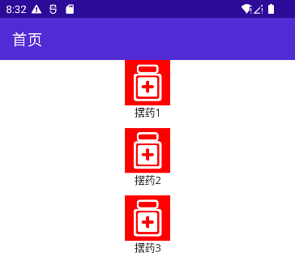
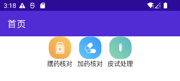

::: tip ✨✨✨✨✨
进阶
:::

<!-- more -->

## 自定义控件外观

当程序页面中需要一些重复的复杂页面结构时，我们可以使用自定义控件外观的方式来避免重复编码。
例：

```xml
<?xml version="1.0" encoding="utf-8" ?>
<ContentPage xmlns="http://schemas.microsoft.com/dotnet/2021/maui"
             xmlns:x="http://schemas.microsoft.com/winfx/2009/xaml"
             x:Class="Mediinfo_MAUI_Demo.MainPage"
             Title="首页">

    <VerticalStackLayout Spacing="10">
        <Grid RowDefinitions="60,20" WidthRequest="60">
            <Image BackgroundColor="Red" Source="baiyaohedui.svg"/>
            <Label Grid.Row="1" Text="摆药核对" HorizontalOptions="Center"/>
        </Grid>
        <Grid RowDefinitions="60,20" WidthRequest="60">
            <Image BackgroundColor="Red" Source="baiyaohedui.svg"/>
            <Label Grid.Row="1" Text="摆药核对" HorizontalOptions="Center"/>
        </Grid>
        <Grid RowDefinitions="60,20" WidthRequest="60">
            <Image BackgroundColor="Red" Source="baiyaohedui.svg"/>
            <Label Grid.Row="1" Text="摆药核对" HorizontalOptions="Center"/>
        </Grid>
    </VerticalStackLayout>

</ContentPage>
```


上述代码可以通过自定义控件外观来简化：

```xml
<?xml version="1.0" encoding="utf-8" ?>
<ContentPage xmlns="http://schemas.microsoft.com/dotnet/2021/maui"
             xmlns:x="http://schemas.microsoft.com/winfx/2009/xaml"
             x:Class="Mediinfo_MAUI_Demo.MainPage"
             Title="首页">

    <ContentPage.Resources>
        <ControlTemplate x:Key="MenuTemplate">
            <Grid RowDefinitions="60,20" WidthRequest="60">
                <Image BackgroundColor="Red" Source="{TemplateBinding Value}"/>
                <Label Grid.Row="1" Text="{TemplateBinding Content}" HorizontalOptions="Center"/>
            </Grid>
        </ControlTemplate>
    </ContentPage.Resources>
  
    <VerticalStackLayout Spacing="10">
        <RadioButton Content="摆药1" Value="baiyaohedui.svg" ControlTemplate="{StaticResource MenuTemplate}"/>
        <RadioButton Content="摆药2" Value="baiyaohedui.svg" ControlTemplate="{StaticResource MenuTemplate}"/>
        <RadioButton Content="摆药3" Value="baiyaohedui.svg" ControlTemplate="{StaticResource MenuTemplate}"/>
    </VerticalStackLayout>

</ContentPage>
```



本段代码中，我们在 ContentPage.Resources 节点中创建了一个控件外观模板，并且在 RadioButton 控件中引用了该模板，这样我们便实现了自定义 RadioButton 的控件外观。
需要注意的是，只用具有 ControlTemplate 属性的控件才支持自定义外观，并且在模板中绑定的属性必须为引用该模板的控件的属性，如本示例中，模板绑定的属性 Value 和 Content 都是 RadioButton 控件中的属性。

## 自定义控件

当我们需要定义一个复杂的控件外观时，现有控件提供的属性可能不满足我们的需求，此时我们可以通过自定义控件来实现。

### 创建自定义控件

新建名为 MenuButtonControl.xaml 的 ContentView 文件，在隐藏代码文件 MenuButtonControl.xaml 中定义所需的属性：

::: tabs
@tab:active .xaml.cs
在 MenuButtonControl.xaml.cs 文件中定义该控件的自定义属性
```csharp 
namespace Mediinfo_MAUI_Demo.Controls;

public partial class MenuButtonControl : ContentView
{
    public static readonly BindableProperty StartPointColorProperty = BindableProperty.Create(nameof(StartPointColor), typeof(Color), typeof(MenuButtonControl), null);
    public static readonly BindableProperty EndPointColorProperty = BindableProperty.Create(nameof(EndPointColor), typeof(Color), typeof(MenuButtonControl), null);
    public static readonly BindableProperty ImageSourceProperty = BindableProperty.Create(nameof(ImageSource), typeof(string), typeof(MenuButtonControl), string.Empty);
    public static readonly BindableProperty PathProperty = BindableProperty.Create(nameof(Path), typeof(string), typeof(MenuButtonControl), string.Empty);
    public static readonly BindableProperty TextProperty = BindableProperty.Create(nameof(Text), typeof(string), typeof(MenuButtonControl), string.Empty);

    public Color StartPointColor
    {
        get => (Color)GetValue(StartPointColorProperty);
        set => SetValue(StartPointColorProperty, value);
    }

    public Color EndPointColor
    {
        get => (Color)GetValue(EndPointColorProperty);
        set => SetValue(EndPointColorProperty, value);
    }
    public string ImageSource
    {
        get => (string)GetValue(ImageSourceProperty);
        set => SetValue(ImageSourceProperty, value);
    }
    public string Path
    {
        get => (string)GetValue(PathProperty);
        set => SetValue(PathProperty, value);
    }
    public string Text
    {
        get => (string)GetValue(TextProperty);
        set => SetValue(TextProperty, value);
    }
    public MenuButtonControl()
	{
		InitializeComponent();
	}
}
```
@tab .xaml
在 MenuButtonControl.xaml 文件中定义该控件的外观
```xml
<?xml version="1.0" encoding="utf-8" ?>
<ContentView xmlns="http://schemas.microsoft.com/dotnet/2021/maui"
             xmlns:x="http://schemas.microsoft.com/winfx/2009/xaml"
             x:Class="Mediinfo_MAUI_Demo.Controls.MenuButtonControl"
             x:Name="this"
             BindingContext="{x:Reference this}">
    <VerticalStackLayout
        HeightRequest="74"
        WidthRequest="56">
        <Border
            HeightRequest="50"
            WidthRequest="50"
            Padding="10"
            StrokeThickness="0"
            HorizontalOptions="Center"
            StrokeShape="RoundRectangle 20">
            <Border.Background>
                <LinearGradientBrush StartPoint="1,0" EndPoint="0,1">
                    <GradientStop Color="{Binding Source={x:Reference this},Path=StartPointColor}"
                          Offset="0.1" />
                    <GradientStop Color="{Binding Source={x:Reference this},Path=EndPointColor}"
                          Offset="1.0" />
                </LinearGradientBrush>
            </Border.Background>
            <Image Source="{Binding Source={x:Reference this},Path=ImageSource}"/>
        </Border>
        <Label 
            HeightRequest="20"
            FontSize="14"
            TextColor="#ff222222"
            Text="{Binding Source={x:Reference this},Path=Text}"/>
    </VerticalStackLayout>
</ContentView>
```
本段代码中，我们在根节点定义了一个别名 this ，并且通过 BindingContext="{x:Reference this}" 将当前控件对象绑定为数据源，这样我们在根结点中定义的任何控件便都可以通过 {Binding Source={x:Reference this},Path=Text} 的形式将隐藏代码文件中的自定义属性绑定在所需控件上了。

:::

### 使用自定义控件

```xml
<?xml version="1.0" encoding="utf-8" ?>
<ContentPage xmlns="http://schemas.microsoft.com/dotnet/2021/maui"
             xmlns:x="http://schemas.microsoft.com/winfx/2009/xaml"
             xmlns:controls="clr-namespace:Mediinfo_MAUI_Demo.Controls"
             x:Class="Mediinfo_MAUI_Demo.MainPage"
             Title="首页">

    <HorizontalStackLayout 
        Spacing="10" 
        VerticalOptions="Start" 
        HorizontalOptions="Center">
        <controls:MenuButtonControl
                ImageSource="baiyaohedui.svg"
                StartPointColor="#f7c563"
                EndPointColor="#ee9f4a"
                Text="摆药核对">
        </controls:MenuButtonControl>
        <controls:MenuButtonControl
                ImageSource="jiayaohedui.svg"
                StartPointColor="#399afa"
                EndPointColor="#66c7ff"
                Text="加药核对">
        </controls:MenuButtonControl>
        <controls:MenuButtonControl
                ImageSource="pishichuli.svg"
                StartPointColor="#61b8c0"
                EndPointColor="#8dd9af"
                Text="皮试处理">
        </controls:MenuButtonControl>
    </HorizontalStackLayout>
</ContentPage>
```

在页面根节点中引入自定义控件的命名空间并设置别名 controls ，然后再需要展示的位置通过 明明控件:空间名称 使用自定义控件 如 controls:MenuButtonControl，在自定义控件中为对应的属性赋值即可。

效果：


