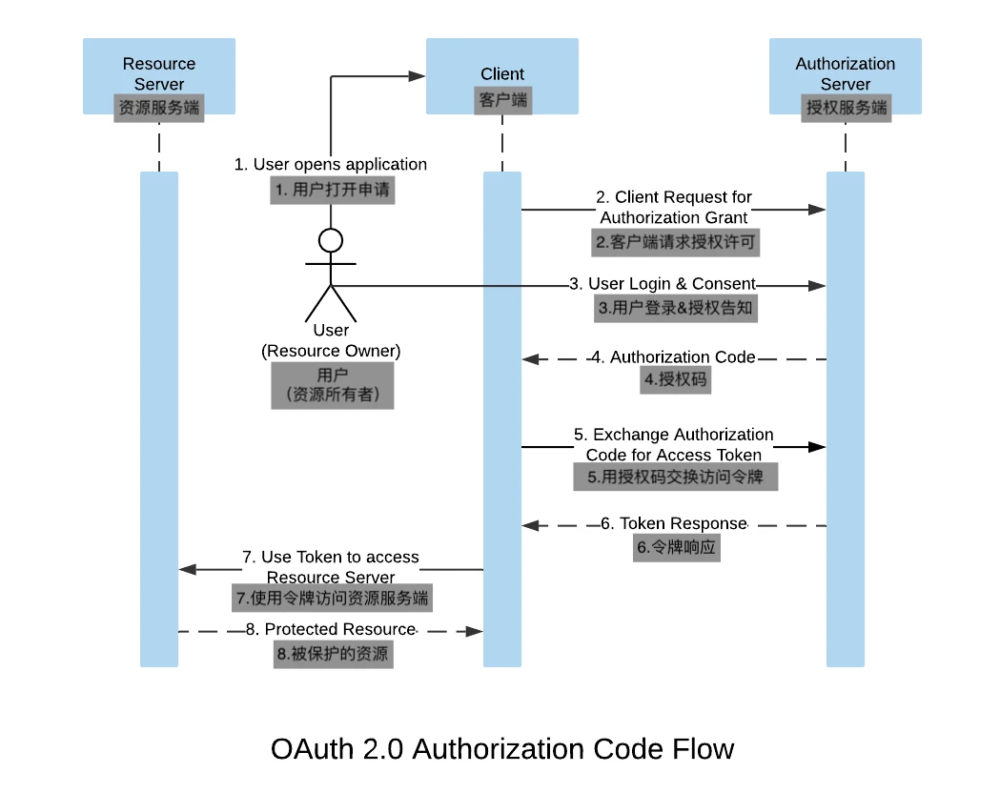
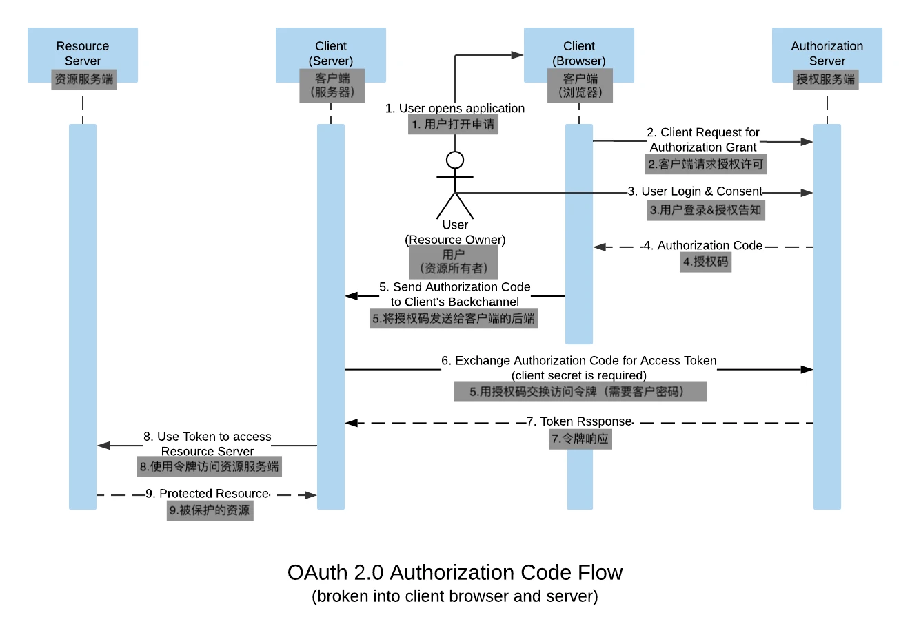

::: tip ✨✨✨✨✨
本文是一篇关于 OAuth 2.0 与 OpenID Connect 协议的完整指南，这两个协议是用于授权和认证的使用最广泛的的协议。OAuth 2.0 用于授权，OpenID Connect 用于认证。有两种 OAuth 2.0 授权流程最为常见：服务端应用程序的授权码流程和基于浏览器的应用程序的隐式流程。OpenID Connect 是 OAuth 2.0 协议之上的标识层，以使 OAuth 适用于认证的用例。
:::

<!-- more -->

## 为什么需要 OAuth？

为了更好地理解 OAuth 诞生的理由，我们需要理解一个术语：代理授权。

### 代理授权

代理授权是一种允许第三方应用访问用户数据的方法。

### 两种代理授权的方式

有两种代理授权的方式：一是你将账号密码提供给第三方应用，以便它们可以代表你来登陆账号并且访问数据；二是你通过 OAuth 授权第三方应用访问你的数据，而无需提供密码。（我相信我们都不会选择交出我们的密码！）

现在，我们知道了 OAuth 的必要性和重要性，让我们更深入地研究这个协议。

## OAuth 2.0

### 什么是 OAuth？

OAuth（Open Authorization，即开放授权）是一个用于代理授权的标准协议。它允许应用程序在不提供用户密码的情况下访问该用户的数据。

### OAuth 2.0 术语表

为理解这个协议，我们需要理解以下术语：

- 资源所有者（Resource Owner）：拥有客户端应用程序想要访问的数据的用户。

- 客户端（Client）：想要访问用户数据的的应用程序

- 授权服务端（Authorization Server）：通过用户许可，授权客户端访问用户数据的授权服务端。

- 资源服务端（Resource Server）：存储客户端要访问的数据的系统。在某些情况下，资源服务端和授权服务端是同一个服务端。

- 访问令牌：访问令牌是客户端可用于访问资源服务端上用户授权的数据的唯一密钥。

以下是 OAuth 2.0 抽象流程图，让我们一起看看上述术语在图中的应用


授权密钥（Authorization Key）或者权限（Grant）可以是授权码或者令牌的类型。下文我们将会提到不同的权限和授权密钥。现在，让我们先详细解释授权的流程。


1. 用户通过点击按钮启动整个授权流程。这个按钮通常类似于“谷歌登陆“、”Facebook 登陆“或者通过其他的应用登陆。

2. 然后客户端将用户重定向到授权服务端。在重定向的过程中，客户端将类似客户 ID、重定向 URI 的信息发送给授权服务端。

3. 授权服务端处理用户认证，并显示授权许可窗口，然后从用户方获得授权许可。如果你通过谷歌登陆，你必须向谷歌，而不是客户端，提供登陆证书——例如向 accounts.google.com 提供登陆证书。

4. 如果用户授权许可，则授权服务端将用户重定向到客户端，同时发送授权密钥（授权码或令牌）。

5. 客户端向资源服务端发送包含授权密钥的请求，要求资源服务端返回用户数据。

6. 资源服务端验证授权密钥，并向客户端返回它所请求的数据。

这就是用户在不提供密码的情况下，允许第三方应用访问用户数据的过程。但与此同时，有一些问题出现了：

- 我们如何限制客户端只访问资源服务端上的部分数据？

- 如果我们只希望客户端读取数据，而没有权限写入数据呢？

这些问题将我们引导至 OAuth 技术术语中另一部分很重要的概念：授权范围（Scope）。

### OAuth 中的授权范围（Scope）

在 OAuth 2.0 中，授权范围用于限制应用程序访问某用户的数据。这是通过发布仅限于用户授权范围的权限来实现的。

当客户端向授权服务端发起权限请求时，它同时随之发送一个授权范围列表。授权客户端根据这个列表生成一个授权许可窗口，并通过用户授权许可。如果用户同意了其授权告知，授权客户端将发布一个令牌或者授权码，该令牌或授权码仅限于用户授权的范围。

举个例子，如果我授权了某客户端应用访问我的谷歌通讯录，则授权服务端向该客户端发布的令牌不能用于删除我的联系人，或者查看我的谷歌日历事件——因为它仅限于读取谷歌通讯录的范围。

### OAuth 2.0 的设置

在讨论 OAuth 流程之前，最好先了解一些 OAuth 的配置。当发起授权权限的请求时，客户端将一些配置数据作为查询参数发送给授权服务端。这些基本的查询参数包括：

- 响应类型（response_type）：我们希望从授权服务端获得的响应类型

- 授权范围（scope）：客户端希望访问的授权范围列表。授权服务端将使用这个列表为用户产生同意授权许可窗口。

- 用户 ID（client_id）：由授权服务在为 OAuth 设置客户端时提供。此 ID 可帮助授权服务端确定正在发送 OAuth 流程的客户端。

- 重定向通用资源标识符（redirect_uri）：用于告知授权服务器当 OAuth 流程完成后重定向的地址

- 客户密码（client_secret）：由授权服务提供，根据 OAuth 流程，这个参数可能需要也可能不需要。我们将在授权码流程中会了解到它的重要性。

### 了解不同的 OAuth 流程

两种最常用的 OAuth2.0 流程是：基于服务器的应用程序所使用的授权码流程，以及纯 JavaScript 单页应用所使用的隐式流程。


为了解释 OAuth 的各类流程，接下来我将用谷歌作为 OAuth 服务提供者。

### 授权码流程

授权码流程，或者说授权码权限，是理想的 OAuth 流程。它被认为是非常安全的，因为它同时使用前端途径（浏览器）和后端途径（服务器）来实现 OAuth2.0 机制。



客户端通过将用户重定向到授权服务端来发起一个授权流程，其中，response_type需被设置成code。这告知了授权服务端用授权码来响应。该流程的 URI 如下所示：

```js
https://accounts.google.com/o/oauth2/v2/auth?
 response_type=code&
 client_id=your_client_id&
 scope=profile%20contacts&
 redirect_uri=https%3A//oauth2.example.com/code
```

在上述请求中，客户端请求能够访问该用户公共主页和联系人的用户许可，这是在scope请求参数中设置的。这个请求的结果是授权码，客户端可以使用该授权码来交换访问令牌。一个授权码如下所示：

```js
4/W7q7P51a-iMsCeLvIaQc6bYrgtp9
```

### 为什么用授权码来交换令牌？

访问令牌是唯一能用于访问资源服务端上的数据的东西，而不是授权码。所以为什么在客户端实际需要访问令牌的情况下，将response_type设置成授权码呢？这是因为这样做能使 OAuth 流程非常安全。



**问题**：访问令牌是我们不希望任何人能访问的秘密信息。如果客户端直接请求访问令牌，并将其存储在浏览器里，它可能会被盗，因为浏览器并不是完全安全的。任何人都能看见网页的代码，或者使用开发工具来获取访问令牌。


**解决方案**：未了避免将访问令牌暴露在浏览器中，客户端的前端从授权服务端获得授权码，然后发送这个授权码到客户端的后端。现在，为了用授权码交换访问令牌，我们需要一个叫做客户密码（client_secret）的东西。这个客户密码只有客户端的后端知道，然后后端向授权服务端发送一个 POST 请求，其中包含了授权码和客户密码。这个请求可能如下所示：

```js
POST /token HTTP/1.1
Host: oauth2.googleapis.com
Content-Type: application/x-www-form-urlencoded
code=4/W7q7P51a-iMsCeLvIaQc6bYrgtp9&
client_id=your_client_id&
client_secret=your_client_secret_only_known_by_server&
redirect_uri=https%3A//oauth2.example.com/code
```

### 隐式流程

当你没有后端程序，并且你的网站是一个仅使用浏览器的静态网站时，应该使用 OAuth2.0 隐式流程。在这种情况下，当你用授权码交换访问令牌时，你跳过发生在后端程序的最后一步。在隐式流程中，授权服务端直接返回访问令牌。


客户端将浏览器重定向到授权服务端 URI，并将response_type设置成token，以启动授权流程。授权服务端处理用户的登录和授权许可。请求的返回结果是访问令牌，客户端可以通过这个令牌访问资源服务端。

隐式流程被认为不那么安全，因为浏览器负责管理访问令牌，因此令牌有可能被盗。尽管如此，它仍然被单页应用广泛使用。

## 认证与授权

正如我们所知，OAuth 解决了代理授权的问题，但是它没有提供一个认证用户身份的标准方法。你可以这样认为：

- OAuth2.0 用于授权

- OpenID Connect 用于认证

如果你无法区分这些术语，则以下是它们之间的区别：

- 认证（Authentication）是确保通信实体是其所声称的实体。

- 授权（Authorization）是验证通信实体是否有权访问资源的过程。

换言之，认证关注的是你是谁，授权关注的是你有什么权限。

## OpenID Connect

OpenID Connect 是在 OAuth2.0 协议之上的标识层。它拓展了 OAuth2.0，使得认证方式标准化。


OAuth 不会立即提供用户身份，而是会提供用于授权的访问令牌。 OpenID Connect 使客户端能够通过认证来识别用户，其中，认证在授权服务端执行。它是这样实现的：在向授权服务端发起用户登录和授权告知的请求时，定义一个名叫openid的授权范围。在告知授权服务器需要使用 OpenID Connect 时，openid是必须存在的范围。

客户端发起的用于 OpenID Connect 认证请求 URI 会是如下的形式：

```js
https://accounts.google.com/o/oauth2/v2/auth?
 response_type=code&
 client_id=your_client_id&
 scope=openid%20contacts&
 redirect_uri=https%3A//oauth2.example.com/code
```

该请求的返回结果是客户端可以用来交换访问令牌和 ID 令牌的授权码。如果 OAuth 流程是隐式的，那么授权服务端将直接返回访问令牌和 ID 令牌。

ID 令牌是 JWT，或者又称 JSON Web Token。JWT 是一个编码令牌，它由三部分组成：头部，有效负载和签名。在获得了 ID 令牌后，客户端可以将其解码，并且得到被编码在有效负载中的用户信息，如以下例子所示：

```js
{
  "iss": "https://accounts.google.com",
  "sub": "10965150351106250715113082368",
  "email": "johndoe@example.com",
  "iat": 1516239022,
  "exp": 1516242922
}
```

### 声明（Claim）

ID 令牌的有效负载包括了一些被称作声明的域。基本的声明有：

- iss：令牌发布者

- sub：用户的唯一标识符

- email：用户的邮箱

- iat：用 Unix 时间表示的令牌发布时间

- exp：Unix 时间表示的令牌到期时间

然而，声明不仅限于上述这些域。由授权服务器对声明进行编码。客户端可以用这些信息来认证用户。

如果客户端需要更多的用户信息，客户端可以指定标准的 OpenID Connect 范围，来告知授权服务端将所需信息包括在 ID 令牌的有效负载中。这些范围包括个人主页（profile）、邮箱（email）、地址（address）和电话（phone）。

英文原文：

[The Complete Guide to OAuth 2.0 and OpenID Connect Protocols](https://betterprogramming.pub/the-complete-guide-to-oauth-2-0-and-openid-connect-protocols-35ebc1cbc11a)