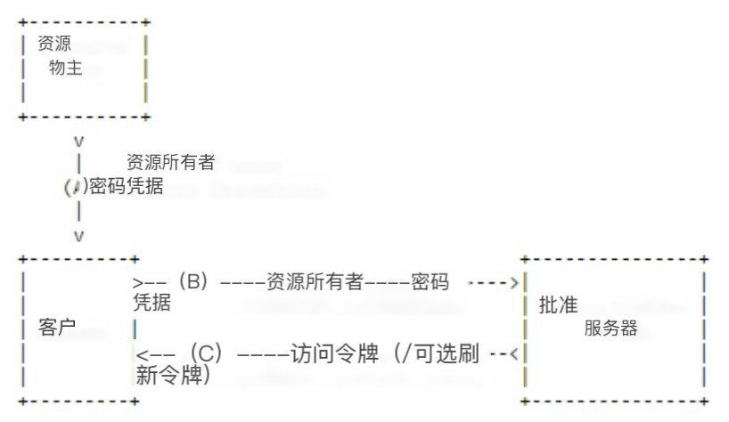

::: tip ✨✨✨✨✨
OpenIddict 是一个开源且通用的框架，用于在任何 ASP.NET Core 2.1（及更高版本）和传统的 ASP.NET 4.6.1（及更高版本）应用程序中构建符合标准的 OAuth 2.0 / OpenID Connect 服务器。
:::

<!-- more -->

## 介绍

### 什么是 OpenIddict？

OpenIddict 是一个开源且通用的框架，用于在任何 ASP.NET Core 2.1（及更高版本）和传统的 ASP.NET 4.6.1（及更高版本）应用程序中构建符合标准的 OAuth 2.0 / OpenID Connect 服务器。

OpenIddict 诞生于2015年末，最初基于 AspNet.Security.OpenIdConnect.Server（代号 ASOS），这是一个低级别的 OpenID Connect 服务器中间件，受到 Microsoft 为 OWIN 项目开发的 OAuth 2.0 授权服务器中间件以及 ASP.NET Core 首个 OpenID Connect 服务器的启发。

2020年，ASOS 被合并到 OpenIddict 3.0 中，形成了一个统一的堆栈，在“降级模式”的帮助下仍能为新用户提供易于使用的方法和为高级用户提供低级别的体验，而不需要支持数据库。

作为这个过程的一部分，OpenIddict 3.0 添加了对 ASP.NET 4.6.1（及更高版本）的原生支持，使其成为替换 `Microsoft.OwinOAuthAuthorizationServerMiddleware` 和 `OAuthBearerAuthenticationMiddleware` 的绝佳选择，无需迁移到 ASP.NET Core。

### 核心概念

#### 用户身份验证

与其他解决方案不同，OpenIddict 专注于授权过程的 OAuth 2.0 / OpenID Connect 协议方面，并将用户身份验证交给实现者：OpenIddict 可与任何形式的用户身份验证（如密码、令牌、联合身份验证或集成 Windows 认证）原生配合使用。虽然方便，但不需要使用类似于 ASP.NET Core Identity 的成员资格堆栈。

#### 通行模式

与 `OAuthAuthorizationServerMiddleware` 类似，OpenIddict 允许在自定义控制器操作或任何其他能够钩入 ASP.NET Core 或 OWIN 请求处理管道的中间件中处理授权、注销和令牌请求。在这种情况下，OpenIddict 将始终首先验证传入请求（例如，通过确保强制参数存在且有效），然后允许调用其余的管道：如果发生任何验证错误，则 OpenIddict 会在到达用户定义的控制器操作或自定义中间件之前自动拒绝请求。

```cs
builder.Services.AddOpenIddict()
    .AddServer(options =>
    {
        // 启用授权和令牌终结点。
        options.SetAuthorizationEndpointUris("/authorize")
               .SetTokenEndpointUris("/token");

        // 启用授权代码流。
        options.AllowAuthorizationCodeFlow();

        // 注册签名和加密凭据。
        options.AddDevelopmentEncryptionCertificate()
               .AddDevelopmentSigningCertificate();

        // 注册ASP.NET Core主机并配置授权终结点
        // 允许/authorify最小API处理程序处理授权请求
        // 经过内置的OpenIddict服务器事件处理程序验证后。
        //
        // 令牌请求将由OpenIddict自己通过重用标识来处理
        // 由/authorify处理程序创建并存储在授权代码中。
        options.UseAspNetCore()
               .EnableAuthorizationEndpointPassthrough();
    });
```

```cs
app.MapGet("/authorize", async (HttpContext context) =>
{
    // 解决存储在Steam身份验证舞蹈后创建的主体中的声明。
    // 如果找不到主体，则触发一个新的挑战，将用户重定向到Steam。
    var principal = (await context.AuthenticateAsync(SteamAuthenticationDefaults.AuthenticationScheme))?.Principal;
    if (principal is null)
    {
        return Results.Challenge(properties: null, new[] { SteamAuthenticationDefaults.AuthenticationScheme });
    }

    var identifier = principal.FindFirst(ClaimTypes.NameIdentifier)!.Value;

    // 创建一个新身份并从Steam主体导入一些精选声明。
    var identity = new ClaimsIdentity(TokenValidationParameters.DefaultAuthenticationType);
    identity.AddClaim(new Claim(Claims.Subject, identifier));
    identity.AddClaim(new Claim(Claims.Name, identifier).SetDestinations(Destinations.AccessToken));

    return Results.SignIn(new ClaimsPrincipal(identity), properties: null, OpenIddictServerAspNetCoreDefaults.AuthenticationScheme);
});
```

#### 事件模式

OpenIddict 为其服务器和验证堆栈实现了一个强大的基于事件的模型：每个请求处理逻辑部分都实现为一个事件处理程序，可以将其移除、移动到管道中的不同位置或替换为自定义处理程序，以覆盖 OpenIddict 使用的默认逻辑。

```cs
/// <summary>
/// 包含负责拒绝未指定有效提示参数的授权请求的逻辑。
/// </summary>
public class ValidatePromptParameter : IOpenIddictServerHandler<ValidateAuthorizationRequestContext>
{
    /// <summary>
    /// 获取分配给此处理程序的默认描述符定义。
    /// </summary>
    public static OpenIddictServerHandlerDescriptor Descriptor { get; }
        = OpenIddictServerHandlerDescriptor.CreateBuilder<ValidateAuthorizationRequestContext>()
            .UseSingletonHandler<ValidatePromptParameter>()
            .SetOrder(ValidateNonceParameter.Descriptor.Order + 1_000)
            .SetType(OpenIddictServerHandlerType.BuiltIn)
            .Build();

    /// <inheritdoc/>
    public ValueTask HandleAsync(ValidateAuthorizationRequestContext context)
    {
        if (context is null)
        {
            throw new ArgumentNullException(nameof(context));
        }

        // 通过同意/登录或选择帐户拒绝指定prompt=none的请求。
        if (context.Request.HasPrompt(Prompts.None) && (context.Request.HasPrompt(Prompts.Consent) ||
                                                        context.Request.HasPrompt(Prompts.Login) ||
                                                        context.Request.HasPrompt(Prompts.SelectAccount)))
        {
            context.Logger.LogInformation(SR.GetResourceString(SR.ID6040));

            context.Reject(
                error: Errors.InvalidRequest,
                description: SR.FormatID2052(Parameters.Prompt),
                uri: SR.FormatID8000(SR.ID2052));

            return default;
        }

        return default;
    }
}
```

在 OpenIddict 中，事件处理程序通常定义为专用类，但也可以使用委托进行注册。

```cs
services.AddOpenIddict()
    .AddServer(options =>
    {
        options.AddEventHandler<HandleConfigurationRequestContext>(builder =>
            builder.UseInlineHandler(context =>
            {
                // 将自定义元数据附加到配置文档。
                context.Metadata["custom_metadata"] = 42;

                return default;
            }));
    });
```

## 入门指南

使用 OpenIddict 实现自定义 OpenID Connect 服务器的最简单选项是克隆 [openiddict-samples](https://github.com/openiddict/openiddict-samples) 存储库中的官方示例之一。

如果您不想从推荐的示例之一开始，您需要：

- 安装 [.NET Core 3.1（或更高版本）](https://dotnet.microsoft.com/zh-cn/download)工具。

- 有一个现有项目或创建一个新项目：在使用 Visual Studio 的默认 ASP.NET Core 模板创建新项目时，强烈建议使用单独的用户帐户身份验证，因为它会自动包括基于 Razor Pages 的默认 ASP.NET Core Identity UI。

更新 `.csproj` 文件以引用最新的包：`OpenIddict`。

```xml
<PackageReference Include="OpenIddict.AspNetCore" Version="4.2.0" />
<PackageReference Include="OpenIddict.EntityFrameworkCore" Version="4.2.0" />
```
- 在 `Startup.ConfigureServices` 中配置 OpenIddict 核心、服务器和验证服务。这是用于机器对机器场景中的客户端凭据授权的示例：

```cs
public void ConfigureServices(IServiceCollection services)
{
    services.AddControllersWithViews();

    services.AddDbContext<ApplicationDbContext>(options =>
    {
        // 将实体框架核心配置为使用Microsoft SQL Server。
        options.UseSqlServer(Configuration.GetConnectionString("DefaultConnection"));

        // 注册OpenIddict所需的实体集。
        // 注意：如果需要替换默认的OpenIddict实体，请使用泛型重载。
        options.UseOpenIddict();
    });

    services.AddOpenIddict()

        // 注册OpenIddict核心组件。
        .AddCore(options =>
        {
            // 配置OpenIddict以使用实体框架核心存储和模型。
            // 注意：调用ReplaceDefaultEntities()来替换默认实体。
            options.UseEntityFrameworkCore()
                   .UseDbContext<ApplicationDbContext>();
        })

        // 注册OpenIddict服务器组件。
        .AddServer(options =>
        {
            // 启用令牌终结点。
            options.SetTokenEndpointUris("connect/token");

            // 启用客户端凭据流。
            options.AllowClientCredentialsFlow();

            // 注册签名和加密凭据。
            options.AddDevelopmentEncryptionCertificate()
                   .AddDevelopmentSigningCertificate();

            // 注册ASP.NET Core主机并配置ASP.NET Core选项。
            options.UseAspNetCore()
                   .EnableTokenEndpointPassthrough();
        })

        // 注册OpenIddict验证组件。
        .AddValidation(options =>
        {
            // 从本地OpenIddict服务器实例导入配置。
            options.UseLocalServer();

            // 注册ASP.NET Core主机。
            options.UseAspNetCore();
        });

    // 向示例客户端注册负责数据库种子设定的工作人员。
    // 注意：在实际应用程序中，此步骤应该是设置脚本的一部分。
    services.AddHostedService<Worker>();
}
```

- 确保 ASP.NET Core 身份验证中间件在正确的位置正确注册：

```cs
public void Configure(IApplicationBuilder app)
{
    app.UseDeveloperExceptionPage();

    app.UseRouting();

    app.UseAuthentication();
    app.UseAuthorization();

    app.UseEndpoints(options =>
    {
        options.MapControllers();
        options.MapDefaultControllerRoute();
    });
}
```

- 更新您的 Entity Framework Core 上下文注册以注册 OpenIddict 实体：

```cs
services.AddDbContext<ApplicationDbContext>(options =>
{
    // 将实体框架核心配置为使用Microsoft SQL Server。
    options.UseSqlServer(Configuration.GetConnectionString("DefaultConnection"));

    // 注册OpenIddict所需的实体集。
    // 注意：如果需要替换默认的OpenIddict实体，请使用泛型重载。
    options.UseOpenIddict();
});
```

:::info
默认情况下，OpenIddict Entity Framework Core 集成使用 string 作为主键的默认类型。如果要使用其他类型，请阅读 [Entity Framework Core 集成：使用自定义主键类型](https://documentation.openiddict.com/integrations/entity-framework-core.html#use-a-custom-primary-key-type)。
:::

- 创建自己的授权控制器：实现自定义授权控制器是必须的，以允许 OpenIddict 根据您提供的标识和声明创建令牌。这是用于机器对机器场景中的客户端凭据授权的示例：

```cs
public class AuthorizationController : Controller
{
    private readonly IOpenIddictApplicationManager _applicationManager;

    public AuthorizationController(IOpenIddictApplicationManager applicationManager)
        => _applicationManager = applicationManager;

    [HttpPost("~/connect/token"), Produces("application/json")]
    public async Task<IActionResult> Exchange()
    {
        var request = HttpContext.GetOpenIddictServerRequest();
        if (!request.IsClientCredentialsGrantType())
        {
            throw new NotImplementedException("The specified grant is not implemented.");
        }

        // 注意：客户端凭据由OpenIddict自动验证：
        // 如果client_id或clientsecret无效，则不会调用此操作。

        var application = await _applicationManager.FindByClientIdAsync(request.ClientId) ??
            throw new InvalidOperationException("The application cannot be found.");

        // 创建一个新的ClaimsIdentity，其中包含
        // 将用于创建一个id_token、一个令牌或一个代码。
        var identity = new ClaimsIdentity(TokenValidationParameters.DefaultAuthenticationType, Claims.Name, Claims.Role);

        // 使用client_id作为主题标识符。
        identity.SetClaim(Claims.Subject, await _applicationManager.GetClientIdAsync(application));
        identity.SetClaim(Claims.Name, await _applicationManager.GetDisplayNameAsync(application));

        identity.SetDestinations(static claim => claim.Type switch
        {
            // 允许将“名称”声明存储在访问令牌和身份令牌中
            // 授予“profile”作用域时（通过调用principle.SSetScope（…））。
            Claims.Name when claim.Subject.HasScope(Scopes.Profile)
                => new[] { Destinations.AccessToken, Destinations.IdentityToken },

            // 否则，只将声明存储在访问令牌中。
            _ => new[] { Destinations.AccessToken }
        });

        return SignIn(new ClaimsPrincipal(identity), OpenIddictServerAspNetCoreDefaults.AuthenticationScheme);
    }
}
```

- 注册您的客户端应用程序（例如，从 IHostedService 实现）：

```cs
public class Worker : IHostedService
{
    private readonly IServiceProvider _serviceProvider;

    public Worker(IServiceProvider serviceProvider)
        => _serviceProvider = serviceProvider;

    public async Task StartAsync(CancellationToken cancellationToken)
    {
        using var scope = _serviceProvider.CreateScope();

        var context = scope.ServiceProvider.GetRequiredService<ApplicationDbContext>();
        await context.Database.EnsureCreatedAsync();

        var manager = scope.ServiceProvider.GetRequiredService<IOpenIddictApplicationManager>();

        if (await manager.FindByClientIdAsync("console") is null)
        {
            await manager.CreateAsync(new OpenIddictApplicationDescriptor
            {
                ClientId = "console",
                ClientSecret = "388D45FA-B36B-4988-BA59-B187D329C207",
                DisplayName = "My client application",
                Permissions =
                {
                    Permissions.Endpoints.Token,
                    Permissions.GrantTypes.ClientCredentials
                }
            });
        }
    }

    public Task StopAsync(CancellationToken cancellationToken) => Task.CompletedTask;
}
```
在运行应用程序之前，请确保通过运行 Add-Migration 和 Update-Database 更新数据库中的 OpenIddict 表。

## 选择正确的流程

OpenIddict 内置支持 [OAuth 2.0](https://datatracker.ietf.org/doc/html/rfc6749) 和 [OpenID Connect](https://openid.net/specs/openid-connect-core-1_0.html) 核心规范定义的所有标准流程：[授权码流程](https://openid.net/specs/openid-connect-core-1_0.html#CodeFlowAuth)、[隐式流程](https://openid.net/specs/openid-connect-core-1_0.html#ImplicitFlowAuth)、[混合流程](https://openid.net/specs/openid-connect-core-1_0.html#HybridFlowAuth)（基本上是前两个流程的混合）、[资源拥有者密码凭据授权](https://datatracker.ietf.org/doc/html/rfc6749#section-4.3)和[客户端凭证授权](https://datatracker.ietf.org/doc/html/rfc6749#section-4.4)。

虽然这不是针对 OpenIddict 的特定内容，但在实现自己的授权服务器时选择最佳流程是一个重要的先决条件；因此，这里简要介绍一下不同的 OAuth 2.0 / OpenID Connect 流程。

### 非交互式流程

#### 资源拥有者密码凭据授权（不建议用于新的应用程序）

受基本身份验证直接启发，资源拥有者密码凭据授权（缩写为ROPC）在概念上是最简单的OAuth 2.0流程：客户端应用程序要求用户输入其用户名/密码，使用用户凭据（根据授权服务器定义的客户端身份验证策略，可能还需要包括自己的客户端凭据）向授权服务器发送令牌请求，并获得可用于检索用户资源的访问令牌。

