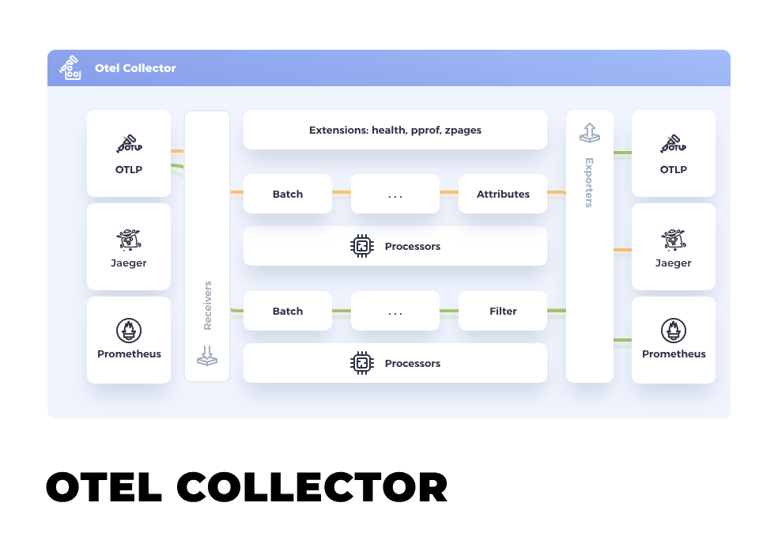

<!-- more -->

::: tip ✨✨✨✨✨
提供与供应商无关的方式来接收、处理和导出遥测数据。
:::

## 介绍

OpenTelemetry Collector 提供了一种与供应商无关的实现方式，用于接收、处理和导出遥测数据。它消除了运行、操作和维护多个代理/收集器的需求。该收集器具有改进的可扩展性，支持开源可观察性数据格式（例如 Jaeger、Prometheus、Fluent Bit 等），可以将数据发送到一个或多个开源或商业后端。本地 Collector 代理是仪器库导出其遥测数据的默认位置。

## 目标

- **可用性**：合理的默认配置，支持流行协议，开箱即用地运行和收集数据。
- **性能**：在不同负载和配置下高度稳定和高效。
- **可观察性**：作为可观察服务的典范。
- **可扩展性**：无需修改核心代码即可定制。
- **统一性**：单一代码库，可部署为代理或收集器，支持追踪、指标和日志。

## 何时使用收集器

对于大多数语言特定的仪器库，您可以使用流行后端和 OTLP 的导出器。您可能会想，在哪些情况下使用收集器发送数据，而不是让每个服务直接发送到后端？

在尝试和开始使用 OpenTelemetry 时，直接将数据发送到后端是快速获得价值的好方法。此外，在开发或小规模环境中，您可以在没有收集器的情况下获得不错的结果。

然而，一般来说，我们建议将收集器与服务一起使用，因为它可以让您的服务快速卸载数据，收集器可以处理额外的操作，例如重试、批处理、加密甚至敏感数据过滤。

设置收集器也比您想象的更容易：每种语言的默认 OTLP 导出器都假设一个本地收集器端点，所以如果您启动一个收集器，它将自动开始接收遥测数据。

## 状态和发布

收集器的状态是：混合的，因为核心收集器组件目前具有混合的稳定性。

收集器组件的成熟度水平各不相同。每个组件的稳定性记录在其 README.md 中。您可以在注册表中找到所有可用收集器组件的列表。

有关发布内容，包括最新版本，请参见 Releases。