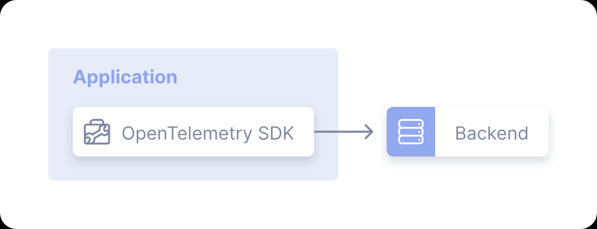

::: tip ✨✨✨✨✨
您可以应用于部署OpenTelemetry收集器的模式

OpenTelemetry收集器由单个二进制文件组成，您可以根据不同的用例以不同的方式使用它。本节描述了部署模式、它们的用例以及优缺点，以及跨环境和多后端部署的收集器配置的最佳实践。

## No Collector
为什么以及如何直接从应用程序发送信号到后端

## Agent
为什么以及如何将信号发送到收集器，然后从那里发送到后端

## Gateway
为什么以及如何将信号发送到一个单一的OTLP端点，然后从那里发送到后端
:::

<!-- more -->

# No Collector

最简单的模式是不使用收集器。这种模式包括使用OpenTelemetry SDK进行应用程序的instrumentation，该应用程序直接将遥测信号（跟踪、指标、日志）导出到后端：

## 示例
查看编程语言的代码instrumentation以获取具体的端到端示例，了解如何直接从您的应用程序向后端导出信号。

## 权衡
### 优点：
- 易于使用（特别是在开发/测试环境中）
- 无需额外的操作部件（在生产环境中）
### 缺点：
- 如果收集、处理或摄入发生变化，需要更改代码
- 应用程序代码与后端之间存在强耦合
- 每种语言实现中可用的导出器数量有限