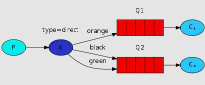

::: tip ✨✨✨✨✨
在 RabbitMQ 中，路由模式（Routing Model）是一种消息传递方式，它允许发布者将消息发送到指定的队列中，并且只有符合特定条件的消费者才能接收到该消息。这种方式通常被用于需要将消息根据不同的路由键进行过滤和分类的场景。
:::

<!-- more -->

## 介绍

在 RabbitMQ 中，路由模式（Routing）是一种消息传递方式，它允许发布者将消息发送到指定的队列中，并且只有符合特定条件的消费者才能接收到该消息。这种方式通常被用于需要将消息根据不同的路由键进行过滤和分类的场景。

在路由模式中，通常需要使用到交换机和多个队列。发布者向交换机发送一条带有路由键的消息，该消息会被转发到匹配的队列中，然后被对应的消费者接收和处理。

直接交换机（Direct Exchange）是 RabbitMQ 中最简单的一种交换机类型，它是根据消息携带的 Routing Key 和队列绑定时设定的 Binding Key 进行精确匹配的，在直接交换机中，可以为多个队列绑定相同的 Binding Key，也可以为同一个队列绑定多个 Binding Key。

### 代码示例

实现一个如下图所示的路由模式示例：



:::tabs
@tab 生产者

```cs
using RabbitMQ.Client;
using System.Text;

// 创建连接工厂对象，指定主机名和登录凭据信息
ConnectionFactory factory = new()
{
    HostName = "192.168.3.100",
    Port = 5672,
    UserName = "guest",
    Password = "guest"
};
// 创建连接和通道
using var connection = factory.CreateConnection();
using var channel = connection.CreateModel();

// 声明直接交换机
channel.ExchangeDeclare(
    exchange: "direct_logs",
    type: ExchangeType.Direct);

// 发送消息到交换机
for (int i = 0; i < 10; i++)
{
    string message1 = $"orange消息 {i}";
    string message2 = $"black消息 {i}";
    string message3 = $"green消息 {i}";
    byte[] body1 = Encoding.UTF8.GetBytes(message1);
    byte[] body2 = Encoding.UTF8.GetBytes(message2);
    byte[] body3 = Encoding.UTF8.GetBytes(message3);

    // 将消息同时发送到两个队列，分别使用不同的 Routing Key
    channel.BasicPublish(
        exchange: "direct_logs", // 指定交换机名称
        routingKey: "orange", // 指定 Routing Key
        basicProperties: null,
        body: body1);

    channel.BasicPublish(
        exchange: "direct_logs", // 指定交换机名称
        routingKey: "black", // 指定 Routing Key
        basicProperties: null,
        body: body2);

    channel.BasicPublish(
        exchange: "direct_logs", // 指定交换机名称
        routingKey: "green", // 指定 Routing Key
        basicProperties: null,
        body: body3);

    Console.WriteLine(" [生产者] 发送消息：{0}，{1}，{2}", message1, message2, message3);
}

Console.WriteLine("按[Enter]键退出");
Console.ReadLine();
```

@tab 消费者1
```cs
using RabbitMQ.Client;
using RabbitMQ.Client.Events;
using System.Text;

// 创建连接工厂对象，指定主机名和登录凭据信息
ConnectionFactory factory = new()
{
    HostName = "192.168.3.100",
    Port = 5672,
    UserName = "guest",
    Password = "guest"
};
// 创建连接和通道
using var connection = factory.CreateConnection();
using var channel = connection.CreateModel();

// 声明直接交换机
channel.ExchangeDeclare(
    exchange: "direct_logs",
    type: ExchangeType.Direct);

// 声明队列，让系统随机生成队列名
var queueName = channel.QueueDeclare().QueueName;

// 绑定队列到交换机，为每个队列分别指定 Binding Key
channel.QueueBind(queue: queueName,
                  exchange: "direct_logs",
                  routingKey: "orange");

Console.WriteLine(" [消费者1] 等待消息中.");

// 创建事件消费者，用于处理接收到的消息
var consumer = new EventingBasicConsumer(channel);

// 处理接收到的消息
consumer.Received += (model, ea) =>
{
    ReadOnlyMemory<byte> body = ea.Body.ToArray();
    string message = Encoding.UTF8.GetString(body.Span);
    Console.WriteLine(" [消费者1] 收到 : {0}", message);
};

// 启动消费者，开始监听队列
channel.BasicConsume(queue: queueName,
                     autoAck: true,
                     consumer: consumer);

Console.WriteLine("按[Enter]键退出");
Console.ReadLine();
```

@tab 消费者2
```cs
using RabbitMQ.Client;
using RabbitMQ.Client.Events;
using System.Text;

// 创建连接工厂对象，指定主机名和登录凭据信息
ConnectionFactory factory = new()
{
    HostName = "192.168.3.100",
    Port = 5672,
    UserName = "guest",
    Password = "guest"
};
// 创建连接和通道
using var connection = factory.CreateConnection();
using var channel = connection.CreateModel();

// 声明直接交换机
channel.ExchangeDeclare(
    exchange: "direct_logs",
    type: ExchangeType.Direct);

// 声明队列，让系统随机生成队列名
var queueName = channel.QueueDeclare().QueueName;

// 绑定队列到交换机，为每个队列分别指定 Binding Key
channel.QueueBind(queue: queueName,
                  exchange: "direct_logs",
                  routingKey: "black");
channel.QueueBind(queue: queueName,
                  exchange: "direct_logs",
                  routingKey: "green");

Console.WriteLine(" [消费者2] 等待消息中.");

// 创建事件消费者，用于处理接收到的消息
var consumer = new EventingBasicConsumer(channel);

// 处理接收到的消息
consumer.Received += (model, ea) =>
{
    ReadOnlyMemory<byte> body = ea.Body.ToArray();
    string message = Encoding.UTF8.GetString(body.Span);
    Console.WriteLine(" [消费者2] 收到 : {0}", message);
};

// 启动消费者，开始监听队列
channel.BasicConsume(queue: queueName,
                     autoAck: true,
                     consumer: consumer);

Console.WriteLine("按[Enter]键退出");
Console.ReadLine();
```
:::

分别启动消费者及生产者客户端，得到如下输出：

:::tabs
@tab 生产者
```shell
[生产者] 发送消息：orange消息 0，black消息 0，green消息 0
[生产者] 发送消息：orange消息 1，black消息 1，green消息 1
[生产者] 发送消息：orange消息 2，black消息 2，green消息 2
[生产者] 发送消息：orange消息 3，black消息 3，green消息 3
[生产者] 发送消息：orange消息 4，black消息 4，green消息 4
[生产者] 发送消息：orange消息 5，black消息 5，green消息 5
[生产者] 发送消息：orange消息 6，black消息 6，green消息 6
[生产者] 发送消息：orange消息 7，black消息 7，green消息 7
[生产者] 发送消息：orange消息 8，black消息 8，green消息 8
[生产者] 发送消息：orange消息 9，black消息 9，green消息 9
按[Enter]键退出
```
@tab 消费者1
```shell
[消费者1] 等待消息中.
按[Enter]键退出
[消费者1] 收到 : orange消息 0
[消费者1] 收到 : orange消息 1
[消费者1] 收到 : orange消息 2
[消费者1] 收到 : orange消息 3
[消费者1] 收到 : orange消息 4
[消费者1] 收到 : orange消息 5
[消费者1] 收到 : orange消息 6
[消费者1] 收到 : orange消息 7
[消费者1] 收到 : orange消息 8
[消费者1] 收到 : orange消息 9
```
@tab 消费者2
```shell
[消费者2] 等待消息中.
按[Enter]键退出
[消费者2] 收到 : black消息 0
[消费者2] 收到 : green消息 0
[消费者2] 收到 : black消息 1
[消费者2] 收到 : green消息 1
[消费者2] 收到 : black消息 2
[消费者2] 收到 : green消息 2
[消费者2] 收到 : black消息 3
[消费者2] 收到 : green消息 3
[消费者2] 收到 : black消息 4
[消费者2] 收到 : green消息 4
[消费者2] 收到 : black消息 5
[消费者2] 收到 : green消息 5
[消费者2] 收到 : black消息 6
[消费者2] 收到 : green消息 6
[消费者2] 收到 : black消息 7
[消费者2] 收到 : green消息 7
[消费者2] 收到 : black消息 8
[消费者2] 收到 : green消息 8
[消费者2] 收到 : black消息 9
[消费者2] 收到 : green消息 9
```
:::

根据输出结果我们可以看到，orange 消息被路由到了 Q1 队列，black 和 green 消息被路由到了 Q2 队列。

在直接交换机中，可以为多个队列绑定相同的 Binding Key，也可以为同一个队列绑定多个 Binding Key，适用于需要将消息分发给多个队列的场景。