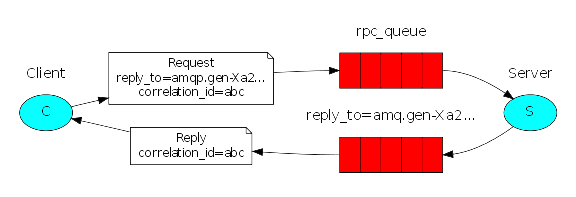

::: tip ✨✨✨✨✨
RPC（Remote Procedure Call）模式是一种实现远程过程调用的消息模式，在 RabbitMQ 中通过将请求和响应封装到消息中，实现了客户端和服务端之间的通信。在 RPC 模式中，客户端发送一个带有回调队列地址的请求消息，服务端接收到请求消息后处理请求，并将响应发送到指定的回调队列中。
:::

<!-- more -->

## 介绍

RPC（Remote Procedure Call）模式是一种实现远程过程调用的消息模式，在 RabbitMQ 中通过将请求和响应封装到消息中，实现了客户端和服务端之间的通信。在 RPC 模式中，客户端发送一个带有回调队列地址的请求消息，服务端接收到请求消息后处理请求，并将响应发送到指定的回调队列中。



## 使用场景

RPC 模式适用于需要实现远程过程调用的场景，比如在分布式系统中，需要将某个操作委托给远程服务器进行处理并返回结果。

## 代码示例

:::tabs
@tab 生产者

```cs
public class RpcClient : IDisposable
{
    private const string QUEUE_NAME = "rpc_queue";

    private readonly IConnection connection;
    private readonly IModel channel;
    private readonly string replyQueueName;
    private readonly ConcurrentDictionary<string, TaskCompletionSource<string>> callbackMapper = new();

    public RpcClient()
    {
        // 创建连接工厂对象，指定主机名和登录凭据信息
        ConnectionFactory factory = new()
        {
            HostName = "192.168.3.100",
            Port = 5672,
            UserName = "guest",
            Password = "guest"
        };

        // 创建连接对象和通道对象
        connection = factory.CreateConnection();
        channel = connection.CreateModel();

        // 创建一个自动生成名称的队列，用于接收来自服务器端的响应消息
        replyQueueName = channel.QueueDeclare().QueueName;

        // 创建并配置一个消费者对象，用于处理从 replyQueueName 队列中接收到的响应消息
        var consumer = new EventingBasicConsumer(channel);
        consumer.Received += (model, ea) =>
        {
            // 从回调字典中查找与该消息相关联的任务源对象，并将响应消息传递给它。
            if (!callbackMapper.TryRemove(ea.BasicProperties.CorrelationId, out var tcs))
                return;
            var body = ea.Body.ToArray();
            var response = Encoding.UTF8.GetString(body);
            tcs.TrySetResult(response);
        };
        channel.BasicConsume(consumer: consumer,
                                queue: replyQueueName,
                                autoAck: true);

        Console.WriteLine("[RPC 客户端] 已注册会掉队列");
    }

    // 发起 RPC 请求的方法，返回一个任务源对象，可用于异步等待服务器端的响应消息。
    public Task<string> CallAsync(string message, CancellationToken cancellationToken = default)
    {
        IBasicProperties props = channel.CreateBasicProperties();
        var correlationId = Guid.NewGuid().ToString();
        props.CorrelationId = correlationId;
        props.ReplyTo = replyQueueName;
        var messageBytes = Encoding.UTF8.GetBytes(message);

        // 创建一个新的任务源对象，用于异步等待服务器端的响应消息。
        var tcs = new TaskCompletionSource<string>();
        callbackMapper.TryAdd(correlationId, tcs);

        // 将请求消息发送到指定的队列上，并在请求消息的属性中添加用于标识该请求的 correlationId 和对应的回调队列名 replyQueueName。
        channel.BasicPublish(exchange: string.Empty,
                                routingKey: QUEUE_NAME,
                                basicProperties: props,
                                body: messageBytes);

        Console.WriteLine($"[RPC 客户端] 已向 RPC 服务端发出请求，请求ID：{correlationId}.");

        // 如果在指定的时间内仍未收到服务器端的响应消息，则取消此次请求。
        cancellationToken.Register(() =>
        {
            callbackMapper.TryRemove(correlationId, out _);
        });
        return tcs.Task;
    }

    // 实现 IDisposable 接口，用于在使用完毕后释放资源。
    public void Dispose()
    {
        connection.Close();
    }
}

private static async Task Main(string[] args)
{
    Console.WriteLine("[RPC 客户端] 正在请求 RPC 服务端");
    // 创建 RpcClient 对象，并使用它发起 RPC 请求。
    await InvokeAsync("30");
    Console.ReadLine();
}

// 定义发起 RPC 请求的方法，其中包括了创建 RpcClient 对象、发起请求并处理响应的完整流程。
private static async Task InvokeAsync(string n)
{
    using var rpcClient = new RpcClient();
    var response = await rpcClient.CallAsync(n);
    Console.WriteLine($"[RPC 客户端] 请求完成，回调结果：{response}");
}
```
:::info

`ConcurrentDictionary`[^1]

`TaskCompletionSource`[^2]

`CancellationToken`[^3]

@tab 消费者

```cs
using RabbitMQ.Client;
using RabbitMQ.Client.Events;
using System.Text;

// 创建连接工厂对象，指定主机名和登录凭据信息
ConnectionFactory factory = new()
{
    HostName = "192.168.3.100",
    Port = 5672,
    UserName = "guest",
    Password = "guest"
};

// 使用连接工厂对象创建一个新的 RabbitMQ 连接和通道对象。
using var connection = factory.CreateConnection();
using var channel = connection.CreateModel();

// 声明一个名为 "rpc_queue" 的队列，用于接收客户端发起的 RPC 请求消息。
channel.QueueDeclare(queue: "rpc_queue",
                     durable: false,
                     exclusive: false,
                     autoDelete: false,
                     arguments: null);

// 设置消费者对象的预取计数，即在当前消费者处理完之前，不会再从队列中取出新的消息。
channel.BasicQos(prefetchSize: 0, prefetchCount: 1, global: false);

// 创建一个事件驱动的消费者对象，用于接收来自 "rpc_queue" 队列中的 RPC 请求消息。
var consumer = new EventingBasicConsumer(channel);

// 定义消费者对象的 Received 事件处理函数，用于在收到客户端发送的 RPC 请求消息后生成响应消息并发送回客户端。
consumer.Received += (model, ea) =>
{
    string response = string.Empty;

    // 从消息体中读取请求数据、CorrelationId 和 ReplyTo 属性值。
    var body = ea.Body.ToArray();
    var props = ea.BasicProperties;
    var replyProps = channel.CreateBasicProperties();
    replyProps.CorrelationId = props.CorrelationId;

    Console.WriteLine($"[RPC服务端] 收到 RPC 客户端请求，ID：{replyProps.CorrelationId}");

    try
    {
        // 解析请求消息中的参数，并调用 Fibonacci 函数进行计算。
        var message = Encoding.UTF8.GetString(body);
        int n = int.Parse(message);
        Console.WriteLine($"[RPC服务端] 解析 RPC 客户端消息：{message}");
        Console.WriteLine($"[RPC服务端] 调用斐波那契函数：Fib({message})");
        response = Fib(n).ToString();
    }
    catch (Exception e)
    {
        // 如果发生错误，则将异常信息作为响应消息返回给客户端。
        Console.WriteLine($"[RPC服务端] 发生异常：{e.Message}");
        response = string.Empty;
    }
    finally
    {
        // 将响应消息发送回客户端，并确认已经处理完当前的请求消息。
        var responseBytes = Encoding.UTF8.GetBytes(response);
        channel.BasicPublish(exchange: string.Empty,
                             routingKey: props.ReplyTo,
                             basicProperties: replyProps,
                             body: responseBytes);
        //消息确认
        channel.BasicAck(deliveryTag: ea.DeliveryTag, multiple: false);
    }

    Console.WriteLine($"[RPC服务端] RPC 客户端消息处理完成");
};

channel.BasicConsume(queue: "rpc_queue", autoAck: false, consumer: consumer);

Console.WriteLine("[RPC服务端] 等待 RPC 请求中。。。");
Console.ReadLine();

// 下面是一个简单的斐波那契函数实现，用于计算 RPC 请求中传递的参数值。
// 注意：该函数的实现采用了递归方式，可能会受到栈深度限制等问题的影响。
static int Fib(int n)
{
    if (n is 0 or 1)
    {
        return n;
    }

    return Fib(n - 1) + Fib(n - 2);
}
```
:::

[^1]:
    **ConcurrentDictionary** 是 .NET Framework 和 .NET Core 中的一个线程安全的哈希表实现，用于存储 key-value 对象。它支持并发读写操作，并且能够在多个线程同时访问时保证数据的一致性和完整性。与传统的 Dictionary 不同，ConcurrentDictionary 中的所有方法都是线程安全的，这意味着我们可以在多个线程中同时添加或删除元素，而不必担心数据冲突或竞争条件等问题。ConcurrentDictionary 提供了许多常见的哈希表操作，例如添加元素、删除元素、更新元素、枚举元素等。由于它是线程安全的，因此可以在高并发场景下使用，例如实现 RPC 系统中客户端和服务器通信过程中的请求-响应映射关系。

[^2]:
    **TaskCompletionSource** 是一个用于创建和管理异步操作的工具类，它允许我们在任何时间手动设置执行结果并通知等待该任务完成的所有线程或任务。具体而言，它提供了以下几个主要的功能：

    1. 创建一个新的 Task 对象并返回它；
    2. 通过 SetResult、SetException 或 SetCanceled 方法设置 Task 的状态，并将其标记为已完成；
    3. 允许异步等待 Task 完成，并等待 SetResult、SetException 或 SetCanceled 方法被调用并将 Task 标记为已完成。
   
    使用 TaskCompletionSource 可以更灵活地控制异步操作的状态和执行过程，例如在异步方法中使用 await 等待开启的任务的结果，或者在异步代码中手动创建任务来表示某些复杂的并发逻辑，从而简化异步程序的实现和维护。

    在 RPC 系统中，TaskCompletionSource 常常用于实现客户端与服务器端之间的请求-响应映射关系，即为每个 RPC 请求创建一个唯一的 Task 实例，并在接收到相应的响应消息时，将响应结果传递给对应的 Task 对象，以便客户端程序获取到服务器端的处理结果。

[^3]:
    **CancellationToken** 是 .NET Framework 和 .NET Core 中的一个用于在多个线程之间协调取消操作的机制。它允许我们创建 CancellationToken 对象，并将其传递给异步或长时间运行的操作，以便在需要时随时取消该操作，避免不必要的资源浪费和性能下降。

    CancellationToken 的主要特点包括：

    1. 它是一个轻量级对象，可以在任何时候创建和传递；
    2. 它支持在异步方法中通过 CancellationTokn 取消异步任务的执行；
    3. 它支持在长时间运行的任务中周期性地检查 CancellationTokn 是否被取消，并及时停止任务的执行；
    4. 它支持取消多个操作，例如同时取消多个 HTTP 请求等。
    
    在 RPC 系统中，CancellationToken 常常用于控制客户端与服务器端之间的通信超时时间，从而避免客户端程序一直阻塞等待服务器端的响应消息而导致性能下降或资源浪费的问题。具体而言，在发起 RPC 请求时，客户端程序可以选择传入一个 CancellationToken 对象以便在需要时随时取消该请求。如果在指定的时间内（通过 CancellationToken 对象的 WithTimeout() 或者 Register() 方法设置）仍未收到服务器端的响应消息，则会自动取消该请求并执行注册的回调函数（即将相关的映射关系从 callbackMapper 字典中移除）。