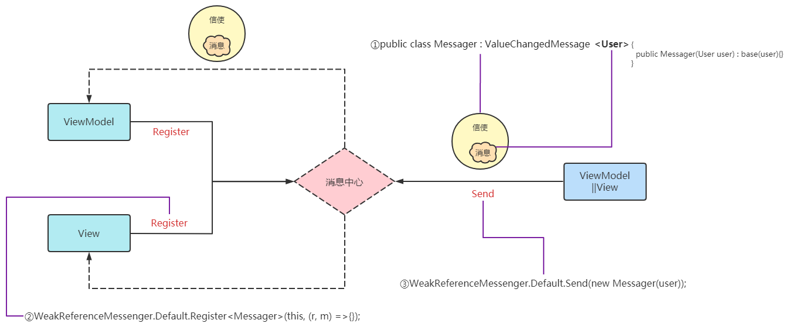

::: tip ✨✨✨✨✨
MAUI相关知识扩展
:::

<!-- more -->

## Messenger

:::info
接口 IMessenger 是可用于在不同对象之间交换消息的类型协定。

当两个对象之间需要建立松耦合关系时，特别适合使用消息机制。如ViewModel需要控制View进行某些操作时，如弹出对话框、播放动画，由于ViewModel对View是无感的，我们不能在ViewModel中去操作View，否则会造成ViewModel对View的依赖。另外，ViewModel层之间、以及View页面之间，也可能需要通过消息传递来完成一些交互。CommunityToolkit.Mvvm提供了比较完善的消息机制，以下内容主要介绍它的使用。

使用前，需安装nuget包：CommunityToolkit.Mvvm。
:::

### 基本过程



如图所示，一个消息的收发，或者叫订阅与发布，主要有三个过程：

1. **创建信使和消息类型：** 信使的作用：一是起到消息发布者与订阅者的桥梁作用；二是携带消息。在代码层面，信使是派生自 `ValueChangedMessage<T>` 或 `RequestMessage<T>` 的普通类，其中泛型 T 为消息的类型。
2. **订阅消息(Register)：** 消息订阅者通过 `WeakReferenceMessenger.Default.Register<T>(this,(r,m)=>{});` 订阅消息，其中泛型T为信使类，只要这个信使类被发布，它就能收到通知和消息。`(r,m)=>{}` 为订阅者收到通知后的执行逻辑，是一个 Lambda 函数，也有叫事件处理者 Handler 。其中参数 r 指消息订阅所在的这个对象，通过 this 传入，通过 r 可以在 Lambda 函数中引用其它成员；参数 m 就是信使携带的消息对象。
3. **发布消息(Send)：** 消息发布者通过 `WeakReferenceMessenger.Default.Send(new一个信息类对象)` 发布消息。

### 创建信使

```cs
//信使类为HiMessenger，消息类型为string
public class HiMessenger: ValueChangedMessage<string> 
{
    public HiMessenger(string value):base(value) //创建信使对象时，通过构造函数初始化消息
    {
        
    }
}
```

### 订阅消息

```cs
WeakReferenceMessenger.Default.Register<HiMessenger>(this, async (r, m) =>
{
    //在这里处理消息，r 是接收方，m 是输入消息。使用作为输入传递的接收者使得 lambda 表达式不会捕获"this",从而提高了性能。
});
```

### 发布消息

```cs
WeakReferenceMessenger.Default.Send(new HiMessenger("Hi,I'm functionMC.I come from China."));
```