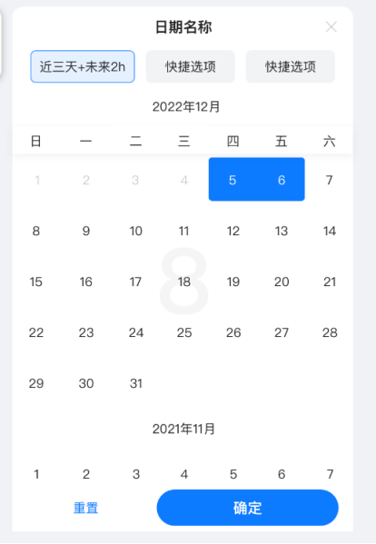
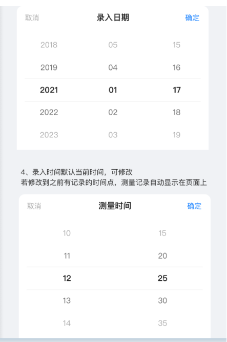

::: tip ✨✨✨✨✨
此文章将向大家分析 MAUI-VUE 混合开发的三种方案：

MAUI原生方案、Web嵌套方案、MAUI原生+Web嵌套方案

三种方案各自的优点及缺点和潜在问题。
:::

<!-- more -->

## MAUI原生方案

### 优点

1. MAUI 中使用的控件均为平台原生 UI，性能和兼容性比较好
2. MAUI 中提供了丰富的与平台交互的 API，可以直接通过这些 API 来访问平台中的大部分功能
3. 相对于混合开发，原生开发的程序复杂度更低，有利于提高开发效率
4. 有利于保持应用 UI 呈现样式的统一

### 缺点及潜在问题

1. 对于部分 UI 控件的界面自定义支持不完善，可能难以实现预期效果
2. 对于页面结构比较复杂的页面，比如多层嵌套页面可能会造成渲染卡顿
3. 每次更新都需要重新打包发布，需要用户重新安装新版应用
4. 存在一定的学习成本，一定程度上会影响开发效率

### 问题举例

.NET MAUI 对于涉及平台的一些功能的支持并不完整，进而会给UI设计中的一些效果实现造成困难，部分举例说明如下：

#### 统一的状态栏

**设计要求：** 设备状态栏 和 应用程序标题栏 保持背景统一

**是否能实现：** 否——仅可实现纯色背景的统一

**原因：** 应用的标题栏样式的控制属于应用内的范畴，我们可以做到高度的定制化，但是平台的状态栏控制是属于平台层面的，MAUI对平台API的封装提供了入口支持对状态栏进行一些简单的设置，但是无法做到和应用内标题栏使用统一连续的背景图片。

#### 选取器

**设计要求：** 在APP中实现如图所示的各种选取器效果

**是否能实现：** 否——暂时可实现近似效果

**原因：** MAUI仅提供了默认的下拉框和时间选取器控件，默认控件与UI设计的差异非常大且不支持样式的自定义设置，若想实现设计效果则需要利用MAUI的其它现有组件进行组合开发，但这并不能完全实现UI设计的效果，例如在MAUI中并没有现成的组件支持上下滑动选项来选取内容，所以通过上下拖动的方式来操作的选取器不易实现

## Web 嵌套方案

### 优点

1. 基于 H5 和 Vue 开发的 Web 页面能很好的进行样式的自定义开发，从而实现复杂的 UI 效果
2. 程序更新只需要在服务端发布，客户端无需任何更改
3. 相较于原生开发，H5 和 Vue 的学低成本更低，进而提高开发效率

### 缺点及潜在问题

1. 所有页面加载均需要请求服务器，因此对网络环境要求较高，可能导致页面加载缓慢甚至加载失败
2. 在 Web 中访问平台中的功能时可能存在困难，还需进一步验证
3. 纯 Web 嵌套的方案可能会给未来的程序开发埋下隐患，造成一些不可预知的问题

## MAUI 原生 + Web 嵌套方案

### 优点

1. 继承了上述两种方案各自的优点，可以灵活组合来实现需求
2. 可以灵活才用其中的一种方案来规避另一种方案可能会造成的问题

### 缺点及潜在问题

1. 学习成本及程序复杂度都比较高，一定程度影响开发效率
2. 原生页面和 Web 页面的 UI 风格保持一致可能存在一定困难
3. 兼容性及稳定性可能不如单一技术方案
