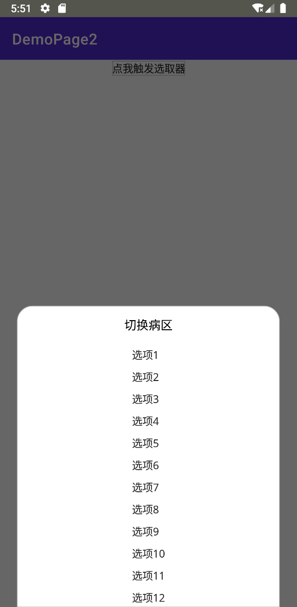

::: tip ✨✨✨✨✨
进阶
:::

<!-- more -->

## 自定义控件外观

当程序页面中需要一些重复的复杂页面结构时，我们可以使用自定义控件外观的方式来避免重复编码。

例：

```xml{8-19}
<?xml version="1.0" encoding="utf-8" ?>
<ContentPage xmlns="http://schemas.microsoft.com/dotnet/2021/maui"
             xmlns:x="http://schemas.microsoft.com/winfx/2009/xaml"
             x:Class="Mediinfo_MAUI_Demo.MainPage"
             Title="首页">

    <VerticalStackLayout Spacing="10">
        <Grid RowDefinitions="60,20" WidthRequest="60">
            <Image BackgroundColor="Red" Source="baiyaohedui.svg"/>
            <Label Grid.Row="1" Text="摆药核对" HorizontalOptions="Center"/>
        </Grid>
        <Grid RowDefinitions="60,20" WidthRequest="60">
            <Image BackgroundColor="Red" Source="baiyaohedui.svg"/>
            <Label Grid.Row="1" Text="摆药核对" HorizontalOptions="Center"/>
        </Grid>
        <Grid RowDefinitions="60,20" WidthRequest="60">
            <Image BackgroundColor="Red" Source="baiyaohedui.svg"/>
            <Label Grid.Row="1" Text="摆药核对" HorizontalOptions="Center"/>
        </Grid>
    </VerticalStackLayout>

</ContentPage>
```


上述代码可以通过自定义控件外观来简化：

```xml{7-14,17-19}
<?xml version="1.0" encoding="utf-8" ?>
<ContentPage xmlns="http://schemas.microsoft.com/dotnet/2021/maui"
             xmlns:x="http://schemas.microsoft.com/winfx/2009/xaml"
             x:Class="Mediinfo_MAUI_Demo.MainPage"
             Title="首页">

    <ContentPage.Resources>
        <ControlTemplate x:Key="MenuTemplate">
            <Grid RowDefinitions="60,20" WidthRequest="60">
                <Image BackgroundColor="Red" Source="{TemplateBinding Value}"/>
                <Label Grid.Row="1" Text="{TemplateBinding Content}" HorizontalOptions="Center"/>
            </Grid>
        </ControlTemplate>
    </ContentPage.Resources>
  
    <VerticalStackLayout Spacing="10">
        <RadioButton Content="摆药1" Value="baiyaohedui.svg" ControlTemplate="{StaticResource MenuTemplate}"/>
        <RadioButton Content="摆药2" Value="baiyaohedui.svg" ControlTemplate="{StaticResource MenuTemplate}"/>
        <RadioButton Content="摆药3" Value="baiyaohedui.svg" ControlTemplate="{StaticResource MenuTemplate}"/>
    </VerticalStackLayout>

</ContentPage>
```


:::info
本段代码中，我们在 ContentPage.Resources 节点中创建了一个控件外观模板，并且在 RadioButton 控件中引用了该模板，这样我们便实现了自定义 RadioButton 的控件外观。
需要注意的是，只用具有 ControlTemplate 属性的控件才支持自定义外观，并且在模板中绑定的属性必须为引用该模板的控件的属性，如本示例中，模板绑定的属性 Value 和 Content 都是 RadioButton 控件中的属性。
:::

## 自定义控件

当我们需要定义一个复杂的控件外观时，现有控件提供的属性可能不满足我们的需求，此时我们可以通过自定义控件来实现。

### 创建自定义控件

新建名为 MenuButtonControl.xaml 的 ContentView 文件，在隐藏代码文件 MenuButtonControl.xaml 中定义所需的属性：

::: tabs
@tab:active .xaml.cs
在 MenuButtonControl.xaml.cs 文件中定义该控件的自定义属性

```csharp{5-9,11-35}
namespace Mediinfo_MAUI_Demo.Controls;

public partial class MenuButtonControl : ContentView
{
    public static readonly BindableProperty StartPointColorProperty = BindableProperty.Create(nameof(StartPointColor), typeof(Color), typeof(MenuButtonControl), null);
    public static readonly BindableProperty EndPointColorProperty = BindableProperty.Create(nameof(EndPointColor), typeof(Color), typeof(MenuButtonControl), null);
    public static readonly BindableProperty ImageSourceProperty = BindableProperty.Create(nameof(ImageSource), typeof(string), typeof(MenuButtonControl), string.Empty);
    public static readonly BindableProperty PathProperty = BindableProperty.Create(nameof(Path), typeof(string), typeof(MenuButtonControl), string.Empty);
    public static readonly BindableProperty TextProperty = BindableProperty.Create(nameof(Text), typeof(string), typeof(MenuButtonControl), string.Empty);

    public Color StartPointColor
    {
        get => (Color)GetValue(StartPointColorProperty);
        set => SetValue(StartPointColorProperty, value);
    }
    public Color EndPointColor
    {
        get => (Color)GetValue(EndPointColorProperty);
        set => SetValue(EndPointColorProperty, value);
    }
    public string ImageSource
    {
        get => (string)GetValue(ImageSourceProperty);
        set => SetValue(ImageSourceProperty, value);
    }
    public string Path
    {
        get => (string)GetValue(PathProperty);
        set => SetValue(PathProperty, value);
    }
    public string Text
    {
        get => (string)GetValue(TextProperty);
        set => SetValue(TextProperty, value);
    }
    public MenuButtonControl()
    {
        InitializeComponent();
    }
}
```

@tab .xaml
在 MenuButtonControl.xaml 文件中定义该控件的外观

```xml{5-6,20,23,27,33}
<?xml version="1.0" encoding="utf-8" ?>
<ContentView xmlns="http://schemas.microsoft.com/dotnet/2021/maui"
             xmlns:x="http://schemas.microsoft.com/winfx/2009/xaml"
             x:Class="Mediinfo_MAUI_Demo.Controls.MenuButtonControl"
             x:Name="this"
             BindingContext="{x:Reference this}">
    <VerticalStackLayout
        HeightRequest="74"
        WidthRequest="56">
        <Border
            HeightRequest="50"
            WidthRequest="50"
            Padding="10"
            StrokeThickness="0"
            HorizontalOptions="Center"
            StrokeShape="RoundRectangle 20">
            <Border.Background>
                <LinearGradientBrush StartPoint="1,0" EndPoint="0,1">
                    <GradientStop 
                        Color="{Binding Source={x:Reference this},Path=StartPointColor}"
                        Offset="0.1" />
                    <GradientStop
                        Color="{Binding Source={x:Reference this},Path=EndPointColor}"
                        Offset="1.0" />
                </LinearGradientBrush>
            </Border.Background>
            <Image Source="{Binding Source={x:Reference this},Path=ImageSource}"/>
        </Border>
        <Label 
            HeightRequest="20"
            FontSize="14"
            TextColor="#ff222222"
            Text="{Binding Source={x:Reference this},Path=Text}"/>
    </VerticalStackLayout>
</ContentView>
```

:::info
本段代码中，我们在根节点定义了一个别名 this ，并且通过 BindingContext="{x:Reference this}" 将当前控件对象绑定为数据源，这样我们在根结点中定义的任何控件便都可以通过 {Binding Source={x:Reference this},Path=Text} 的形式将隐藏代码文件中的自定义属性绑定在所需控件上了。

:::

### 使用自定义控件

```xml{12-29}
<?xml version="1.0" encoding="utf-8" ?>
<ContentPage xmlns="http://schemas.microsoft.com/dotnet/2021/maui"
             xmlns:x="http://schemas.microsoft.com/winfx/2009/xaml"
             xmlns:controls="clr-namespace:Mediinfo_MAUI_Demo.Controls"
             x:Class="Mediinfo_MAUI_Demo.MainPage"
             Title="首页">

    <HorizontalStackLayout 
        Spacing="10" 
        VerticalOptions="Start" 
        HorizontalOptions="Center">
        <controls:MenuButtonControl
                ImageSource="baiyaohedui.svg"
                StartPointColor="#f7c563"
                EndPointColor="#ee9f4a"
                Text="摆药核对">
        </controls:MenuButtonControl>
        <controls:MenuButtonControl
                ImageSource="jiayaohedui.svg"
                StartPointColor="#399afa"
                EndPointColor="#66c7ff"
                Text="加药核对">
        </controls:MenuButtonControl>
        <controls:MenuButtonControl
                ImageSource="pishichuli.svg"
                StartPointColor="#61b8c0"
                EndPointColor="#8dd9af"
                Text="皮试处理">
        </controls:MenuButtonControl>
    </HorizontalStackLayout>
</ContentPage>
```

:::info
在页面根节点中引入自定义控件的命名空间并设置别名 controls ，然后再需要展示的位置通过 命名空间:控件名称 使用自定义控件 如 controls:MenuButtonControl，在自定义控件中为对应的属性赋值即可。
:::

效果：


## 自定义选取器

在很多场景中，我们都需要使用选取器来完成预期的功能和操作，但 MAUI 框架本身并没有提供一个支持高度自定义的选取器控件，这时我们可以使用社区工具包提供的 Popup 弹出组件来开发自定义选取器。

::: warning
Popup 只能在 Page 或继承于 Page 的类中使用。
:::

### 安装社区工具包

参照[官方教程](https://learn.microsoft.com/zh-cn/dotnet/communitytoolkit/maui/get-started)安装

### 自定义选取器弹出控件

选取器弹出控件是点击某个选取器后弹出的内容，该控件是对弹出层的单独定义。

选取器作为一个公共控件，弹出层的基本的外观及内容应该支持自定义，所以我们在封装选取器控件时应当开放出部分参数由外部传入。

::: tabs
@tab PickControlView.xaml

选择器的外观由一个 Label 和一个 CollectionView 组成，Lable 显示选选取器标题，CollectionView 显示选项列表

```xml
<?xml version="1.0" encoding="utf-8" ?>
<toolkit:Popup 
    xmlns="http://schemas.microsoft.com/dotnet/2021/maui"
    xmlns:x="http://schemas.microsoft.com/winfx/2009/xaml"
    xmlns:toolkit="http://schemas.microsoft.com/dotnet/2022/maui/toolkit"
    x:Class="Mediinfo_MAUI_Demo.Controls.PickControlView"
    VerticalOptions="End"
    Color="Transparent"
    x:Name="this"
    BindingContext="{x:Reference this}">
    <Border StrokeShape="RoundRectangle 20,20,0,0">
        <Grid>
            <Grid.RowDefinitions>
                <RowDefinition Height="50"/>
                <RowDefinition/>
            </Grid.RowDefinitions>
            <Label 
                Text="{Binding Title}" 
                TextColor="Black" 
                FontSize="16"
                HorizontalOptions="Center"
                VerticalOptions="Center"/>
            <CollectionView
                Grid.Row="1"
                x:Name="pickCollection"
                HorizontalOptions="Center"
                SelectionChanged="pickCollection_SelectionChanged"
                SelectionMode="Single">
            </CollectionView>
        </Grid>
    </Border>
</toolkit:Popup>
```

@tab PickControlView.xaml.cs

PickControlView 需继承 Popup 类。

通过构造函数对 PickControlView 类做一定的限制，要求在外部初始化该选取器时指定 itemSource(数据源)、itemTemplate(数据模板)、size(弹窗尺寸)、title(选取器标题) 这几个参数的值。

pickCollection_SelectionChanged 选择事件，定义了一个处理程序，在选择某个选项后通过 Popup.Close() 方法关闭选取器弹窗，并回传所选的值。

```cs
using CommunityToolkit.Maui.Views;
using System.Collections;

namespace Mediinfo_MAUI_Demo.Controls;

public partial class PickControlView : Popup
{
    public static readonly BindableProperty TitleProperty = BindableProperty.Create(nameof(Title), typeof(string), typeof(PickControlView), string.Empty);

    public string Title
    {
        get => (string)GetValue(TitleProperty);
        set => SetValue(TitleProperty, value);
    }
    public PickControlView(IEnumerable itemSource, DataTemplate itemTemplate, Size size, string title)
    {
        InitializeComponent();
        pickCollection.ItemTemplate = itemTemplate;
        pickCollection.ItemsSource = itemSource;
        Size = size;
        Title = title;
    }

    private async void pickCollection_SelectionChanged(object sender, SelectionChangedEventArgs e)
    {
        var currentItem = e.CurrentSelection.FirstOrDefault();
        Close(currentItem);
    }
}
```

:::

### 自定义下拉菜单控件

上一步我们定义了 [选取器弹出控件](#自定义选取器弹出控件)，所以接下来我们需要定义一个选取器弹出层的载体，也就是触发弹出框的组件。

::: tabs
@tab DropDownButton.xaml

此处简单定义了一个 Lable 作为控件的呈现外观，并为控件绑定了 TapGestureRecognizer_Tapped 点击事件。

```xml
<?xml version="1.0" encoding="utf-8" ?>
<ContentPage xmlns="http://schemas.microsoft.com/dotnet/2021/maui"
        xmlns:x="http://schemas.microsoft.com/winfx/2009/xaml"
        x:Class="Mediinfo_MAUI_Demo.Controls.DropDownButton2"
        x:Name="this"
        BindingContext="{x:Reference this}"
        BackgroundColor="Transparent">

    <ContentPage.Content>
        <Border HorizontalOptions="Center">
            <Label 
                HorizontalOptions="Center" 
                VerticalOptions="Center"
                TextColor="#222222"
                Text="{Binding Source={Reference this},Path=ButtonText}">
                <Label.GestureRecognizers>
                    <TapGestureRecognizer Tapped="TapGestureRecognizer_Tapped"/>
                </Label.GestureRecognizers>
            </Label>
        </Border>
    </ContentPage.Content>
</ContentPage>
```

@tab DropDownButton.xaml.cs

此处定义了一些自定义属性用于接收外部参数，并且为 TapGestureRecognizer_Tapped 点击事件定义了一个处理程序，当点击该 Lable 控件时，就根据传入参数通过 ShowPopupAsync() 方法初始化一个选择器，并以弹窗的形式展示选择的结果。

```cs
using CommunityToolkit.Maui.Views;
using Mediinfo_MAUI_Demo.Models;
using System.Collections;

namespace Mediinfo_MAUI_Demo.Controls;

public partial class DropDownButton2 : ContentPage
{
    public static readonly BindableProperty ButtonTextProperty = BindableProperty.Create(nameof(ButtonText), typeof(string), typeof(DropDownButton), string.Empty);
    public static readonly BindableProperty ItemSourceProperty = BindableProperty.Create(nameof(ItemSource), typeof(IEnumerable), typeof(DropDownButton), defaultBindingMode: BindingMode.OneWay);
    public string ButtonText
    {
        get => (string)GetValue(ButtonTextProperty);
        set => SetValue(ButtonTextProperty, value);
    }
    public IEnumerable ItemSource
    {
        get => (IEnumerable)GetValue(ItemSourceProperty);
        set => SetValue(ItemSourceProperty, value);
    }
    public DropDownButton2()
    {
        InitializeComponent();
    }
    public DataTemplate ItemTemplate { get; set; }
    public Size Size { get; set; }

    private async void TapGestureRecognizer_Tapped(object sender, TappedEventArgs e)
    {
        var resultObj = await this.ShowPopupAsync(new PickControlView(ItemSource, ItemTemplate, Size, Title));
        var result = resultObj as SelectValueModel;
        if (result != null)
        {
            await DisplayAlert(result.Title, result.Value.ToString(), "取消");
        }
    }
}
```

:::

### 使用自定义选择器

::: tabs
@tab DemoPage2.xaml

引入自定义控件命名空间，指定相应的选取器按钮标题、弹出层标题、弹出层尺寸、弹出层数据模板等。

```xml
<?xml version="1.0" encoding="utf-8" ?>
<ContentPage xmlns="http://schemas.microsoft.com/dotnet/2021/maui"
             xmlns:x="http://schemas.microsoft.com/winfx/2009/xaml"
             xmlns:viewmodel="clr-namespace:Mediinfo_MAUI_Demo.ViewModels"
             xmlns:controls="clr-namespace:Mediinfo_MAUI_Demo.Controls"
             x:Class="Mediinfo_MAUI_Demo.Views.DemoPage2"
             Title="DemoPage2">
    <ContentPage.BindingContext>
        <viewmodel:DemoPage2ViewModel/>
    </ContentPage.BindingContext>
    <VerticalStackLayout>
        <controls:DropDownButton2 
            x:Name="dropDownControl"
            Grid.Column="0" 
            Title="切换病区"
            ButtonText="点我触发选取器" 
            HeightRequest="22"
            Size="350,400">
            <controls:DropDownButton2.ItemTemplate>
                <DataTemplate>
                    <Label 
                        HorizontalOptions="Center" 
                        Padding="0,5,0,5" 
                        Text="{Binding Title}"></Label>
                </DataTemplate>
            </controls:DropDownButton2.ItemTemplate>
        </controls:DropDownButton2>
    </VerticalStackLayout>
</ContentPage>
```

@tab DemoPage2.xaml.cs

在构造函数中为选取器控件生成初始数据。

```cs
using Mediinfo_MAUI_Demo.Models;

namespace Mediinfo_MAUI_Demo.Views;

public partial class DemoPage2 : ContentPage
{
	public DemoPage2()
	{
		InitializeComponent();
        List<SelectValueModel> list = new();
        for (int i = 1; i <= 20; i++)
        {
            list.Add(new()
            {
                Title = $"选项{i}",
                Value = i
            });
        }
        dropDownControl.ItemSource = list;
    }
}
```

:::

效果：





