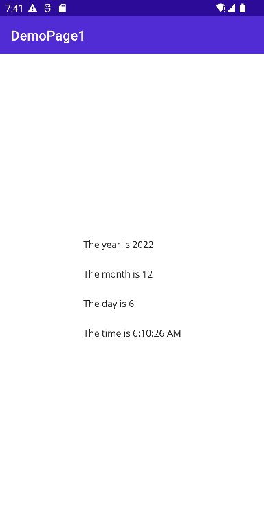
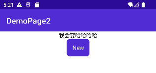

::: tip ✨✨✨✨✨
XAML重点基础知识
:::

<!-- more -->

## [基本语法](https://learn.microsoft.com/zh-cn/dotnet/maui/xaml/fundamentals/essential-syntax?view=net-maui-7.0)

## [标记扩展](https://learn.microsoft.com/zh-cn/dotnet/maui/xaml/markup-extensions/consume?view=net-maui-7.0)

### 基本用法

在单个页面中，如果有多个属性相同的控件，而你不想在修改时去更改每一个控件，可使用 共享资源 来避免重复定义属性。

例：

```xml {6-26}
<ContentPage xmlns="http://schemas.microsoft.com/dotnet/2021/maui"
             xmlns:x="http://schemas.microsoft.com/winfx/2009/xaml"
             x:Class="XamlSamples.SharedResourcesPage"
             Title="Shared Resources Page">
    <StackLayout>
        <Button Text="Do this!"
                HorizontalOptions="Center"
                VerticalOptions="Center"
                BorderWidth="3"
                Rotation="-15"
                TextColor="Red"
                FontSize="24" />
        <Button Text="Do that!"
                HorizontalOptions="Center"
                VerticalOptions="Center"
                BorderWidth="3"
                Rotation="-15"
                TextColor="Red"
                FontSize="24" />
        <Button Text="Do the other thing!"
                HorizontalOptions="Center"
                VerticalOptions="Center"
                BorderWidth="3"
                Rotation="-15"
                TextColor="Red"
                FontSize="24" />
    </StackLayout>
</ContentPage>
```

你可以用如下方式在该页面中定义 [资源字典](https://learn.microsoft.com/zh-cn/dotnet/maui/fundamentals/resource-dictionaries?view=net-maui-7.0)：

```xml {5-10}
<ContentPage xmlns="http://schemas.microsoft.com/dotnet/2021/maui"
             xmlns:x="http://schemas.microsoft.com/winfx/2009/xaml"
             x:Class="XamlSamples.SharedResourcesPage"
             Title="Shared Resources Page">
    <ContentPage.Resources>
        <LayoutOptions x:Key="horzOptions"
                       Alignment="Center" />
        <LayoutOptions x:Key="vertOptions"
                       Alignment="Center" />
    </ContentPage.Resources>
   <!--其他代码-->
</ContentPage>
```

上述代码定义了两个值作为当前页面的资源，分别是 horzOptions 和 vertOptions

资源字典使用方法：

```xml {2-3}
<Button Text="Do this!"
        HorizontalOptions="{StaticResource horzOptions}"
        VerticalOptions="{StaticResource vertOptions}"
        BorderWidth="3"
        Rotation="-15"
        TextColor="Red"
        FontSize="24" />
```

### x:Static 标记扩展

x:Static 标记扩展的主要用途是引用自己代码中的静态字段或属性

下面的代码展示了其基本用法：

::: tabs

@tab:active 1 定义静态字段

该类中定义了多个颜色，你可能想在多个页面中使用它
```csharp
namespace XamlSamples
{
    static class AppConstants
    {
        public static readonly Color BackgroundColor = Colors.Aqua;
        public static readonly Color ForegroundColor = Colors.Brown;
    }
}
```

@tab 2 静态字段使用

若要在 XAML 文件中引用此类的静态字段，需要使用 XML 命名空间声明来指示此文件所在的位置
`xmlns:local="clr-namespace:XamlSamples"`
```xml {3,9-10}
<ContentPage xmlns="http://schemas.microsoft.com/dotnet/2021/maui"
  xmlns:x="http://schemas.microsoft.com/winfx/2009/xaml"
  xmlns:local="clr-namespace:XamlSamples"
  x:Class="XamlSamples.StaticConstantsPage"
  Title="Static Constants Page"
  Padding="5,25,5,0">
  <StackLayout>
    <Label Text="Hello, XAML!"
      TextColor="{x:Static local:AppConstants.BackgroundColor}"
      BackgroundColor="{x:Static local:AppConstants.ForegroundColor}"
      FontAttributes="Bold"
      FontSize="30"
      HorizontalOptions="Center" />
  </StackLayout>
</ContentPage>
```

:::

还可以 XAML 文件中引用系统命名空间中的对象。

例：

```xml{3,6,10-13}
<ContentPage xmlns="http://schemas.microsoft.com/dotnet/2021/maui"
             xmlns:x="http://schemas.microsoft.com/winfx/2009/xaml"
             xmlns:sys="clr-namespace:System;assembly=netstandard"
             x:Class="Mediinfo_MAUI_Demo.Views.DemoPage1"
             Title="DemoPage1">
    <VerticalStackLayout BindingContext="{x:Static sys:DateTime.Now}"
                         Spacing="25" Padding="30,0"
                         VerticalOptions="Center" HorizontalOptions="Center">

        <Label Text="{Binding Year, StringFormat='The year is {0}'}" />
        <Label Text="{Binding Month, StringFormat='The month is {0}'}" />
        <Label Text="{Binding Day, StringFormat='The day is {0}'}" />
        <Label Text="{Binding StringFormat='The time is {0:T}'}" />

    </VerticalStackLayout>
</ContentPage>
```

本段代码中，System 系统命名空间位于 netstandard 程序集中，所以需要用 assembly 指定程序集名称。

## [数据绑定](https://learn.microsoft.com/zh-cn/dotnet/maui/xaml/fundamentals/data-binding-basics?view=net-maui-7.0)

数据绑定用来连接两个对象的属性，这两个属性称为 **源** 和 **目标**

源和目标一般通过如下两个标记指定：

1. **`BindingContext`** 为目标对象指定数据源对象
2. **`Binding`** 为目标属性绑定源对象中的属性

在 XAML 中定义数据绑定时，也可以通过 StaticResource 或 x:Static 标记扩展设置 BindingContext 目标对象。

### View-View 绑定

可以定义数据绑定以关联同一页面上两个控件的属性。

例：

```xml{7-8,13,17-18}
<ContentPage xmlns="http://schemas.microsoft.com/dotnet/2021/maui"
             xmlns:x="http://schemas.microsoft.com/winfx/2009/xaml"
             x:Class="XamlSamples.SliderBindingsPage"
             Title="Slider Bindings Page">
    <StackLayout>
        <Label Text="ROTATION"
               BindingContext="{x:Reference slider}"
               Rotation="{Binding Path=Value}"
               FontAttributes="Bold"
               FontSize="18"
               HorizontalOptions="Center"
               VerticalOptions="Center" />
        <Slider x:Name="slider"
                Maximum="360"
          			Value="10"
                VerticalOptions="Center" />
        <Label BindingContext="{x:Reference slider}"
               Text="{Binding Value, StringFormat='The angle is {0:F0} degrees'}"
               FontAttributes="Bold"
               FontSize="18"
               HorizontalOptions="Center"
               VerticalOptions="Center" />
    </StackLayout>
</ContentPage>
```

:::info
**`x:Name`** 用来为被引用元素指定一个别名

**`BindingContext`** 用来设置元素当前要绑定的数据源对象

**`Bingding Path`** 用来绑定当前对象中的某个属性，若绑定的属性只有一个，则可以省略 Path

在本段代码中，第一个 Label 的 Rotation 属性和第二个 Label 的 Text 属性都和 Slider.Value 的值进行了绑定

**在 .NET MAUI 中，绑定不执行任何隐式类型转换，如果需要将非字符串对象显示为字符串，则必须提供类型转换器或使用 StringFormat。**
:::

### [MVVM](https://learn.microsoft.com/zh-cn/dotnet/maui/xaml/fundamentals/mvvm?view=net-maui-7.0)

#### 什么是MVVM？

MVVM 架构是微软官方推荐用于 MAUI 应用开发的架构，常用于基于基础数据模型的交互式视图的双向数据绑定。

MVVM是一种设计思想，他是 `Model-View-ViewMode` 的缩写。

- **`Model`** 模型，指后端传递的数据
- **`View`** 视图，指所看到的页面
- **`ViewModel`** 视图模型，是 mvvm 模式的核心，是连接 view 和 model 的桥梁。它主要有两个作用：

将模型（Model）转化成视图 (View)，即将后端传递的数据转化成所看到的页面。实现的方式是：数据绑定
将视图 (View) 转化成模型 (Model)，即将所看到的页面转化成后端的数据。实现的方式是：DOM 事件 监听。
这两个方向都实现的，我们称之为数据的**双向绑定**

#### 简单MVVM

在 [x:Static 标记扩展](#x-static-标记扩展)章节，我们介绍了如何使用 x:Static 标记扩展从命名空间中的 System 静态 DateTime.Now 属性获取当前日期和时间：

```xml{4,7,11-14}
<?xml version="1.0" encoding="utf-8" ?>
<ContentPage xmlns="http://schemas.microsoft.com/dotnet/2021/maui"
             xmlns:x="http://schemas.microsoft.com/winfx/2009/xaml"
             xmlns:sys="clr-namespace:System;assembly=netstandard"
             x:Class="Mediinfo_MAUI_Demo.Views.DemoPage1"
             Title="DemoPage1">
    <VerticalStackLayout BindingContext="{x:Static sys:DateTime.Now}"
                         Spacing="25" Padding="30,0"
                         VerticalOptions="Center" HorizontalOptions="Center">

        <Label Text="{Binding Year, StringFormat='The year is {0}'}" />
        <Label Text="{Binding Month, StringFormat='The month is {0}'}" />
        <Label Text="{Binding Day, StringFormat='The day is {0}'}" />
        <Label Text="{Binding StringFormat='The time is {0:T}'}" />

    </VerticalStackLayout>
</ContentPage>
```



这种写法在构造和初始化页面时只会设置日期和时间一次，并且永远不会更改。

若想实现页面上的时间自动更新，则需要为该页面创建一个ViewModel。

例：

```csharp{8,11-22,29-30}
using System.ComponentModel;

namespace Mediinfo_MAUI_Demo.ViewModels;

public class DemoPage1ViewModel : INotifyPropertyChanged
{
    public event PropertyChangedEventHandler PropertyChanged;
    private DateTime _dateTime;
    private Timer _timer;

    public DateTime DateTime
    {
        get => _dateTime;
        set
        {
            if (_dateTime != value)
            {
                _dateTime = value;
                PropertyChanged?.Invoke(this, new PropertyChangedEventArgs(nameof(DateTime))); // 通知属性变更
            }
        }
    }

    public DemoPage1ViewModel()
    {
        this.DateTime = DateTime.Now;

        // 每秒更新时间
        _timer = new Timer(new TimerCallback((s) => this.DateTime = DateTime.Now),
                           null, TimeSpan.Zero, TimeSpan.FromSeconds(1));
    }

    ~DemoPage1ViewModel() =>
        _timer.Dispose();
}

```

:::info
.NET MAUI 中的数据绑定机制将处理程序附加到此 PropertyChanged 事件，以便在属性更改时通知它，并将目标更新为新的值，所以 Viewmodel 需要实现 INotifyPropertyChanged 接口来获取 PropertyChanged 事件。

我们定义了一个私有的计时器 _timer 和一个私有字段 _dataTime，然后分别在构造函数中初始化计时器，并且每秒钟都会通过公共属性 DateTime 对私有字段 _dataTime 更新，同时通知属性变化。
:::

ViewModel创建完毕后还需要跟视图做绑定，一般有如下两种绑定方式：

::: tabs
@tab:active 在.xaml中设置ViewModel数据源
```xml{5,8-10}
<?xml version="1.0" encoding="utf-8" ?>
<ContentPage xmlns="http://schemas.microsoft.com/dotnet/2021/maui"
             xmlns:x="http://schemas.microsoft.com/winfx/2009/xaml"
             xmlns:sys="clr-namespace:System;assembly=netstandard"
             xmlns:viewmodel="clr-namespace:Mediinfo_MAUI_Demo.ViewModels"
             x:Class="Mediinfo_MAUI_Demo.Views.DemoPage1"
             Title="DemoPage1">
    <ContentPage.BindingContext>
        <viewmodel:DemoPage1ViewModel/>
    </ContentPage.BindingContext>
    <!--其他代码-->
</ContentPage>
```
@tab 在.xaml.cs设置ViewModel数据源
```csharp{7,10}
using Mediinfo_MAUI_Demo.ViewModels;

namespace Mediinfo_MAUI_Demo.Views;

public partial class DemoPage1 : ContentPage
{
    public DemoPage1(DemoPage1ViewModel demoPage1ViewModel)
    {
        InitializeComponent();
        BindingContext = demoPage1ViewModel;
    }
}
```
由于这种方式用到了依赖注入，所以必须同时在项目的入口文件 MauiProgram 中注入对应的视图和ViewModel：
```csharp{18-19}
//MauiProgram.cs
using Mediinfo_MAUI_Demo.ViewModels;
using Mediinfo_MAUI_Demo.Views;
using Microsoft.Extensions.Logging;

namespace Mediinfo_MAUI_Demo;

public static class MauiProgram
{
    public static MauiApp CreateMauiApp()
    {
        var builder = MauiApp.CreateBuilder();
        builder.UseMauiApp<App>().ConfigureFonts(fonts =>
        {
            fonts.AddFont("OpenSans-Regular.ttf", "OpenSansRegular");
            fonts.AddFont("OpenSans-Semibold.ttf", "OpenSansSemibold");
        });
        builder.Services.AddSingleton<DemoPage1ViewModel>();
        builder.Services.AddSingleton<DemoPage1>();
        return builder.Build();
    }
}
```
:::

在页面中绑定时间：

```xml{12-15}
<?xml version="1.0" encoding="utf-8" ?>
<ContentPage xmlns="http://schemas.microsoft.com/dotnet/2021/maui"
             xmlns:x="http://schemas.microsoft.com/winfx/2009/xaml"
             xmlns:sys="clr-namespace:System;assembly=netstandard"
             xmlns:viewmodel="clr-namespace:Mediinfo_MAUI_Demo.ViewModels"
             x:Class="Mediinfo_MAUI_Demo.Views.DemoPage1"
             Title="DemoPage1">
    <ContentPage.BindingContext>
        <viewmodel:DemoPage1ViewModel/>
    </ContentPage.BindingContext>

    <Label Text="{Binding DateTime, StringFormat='{0:T}'}"
           FontSize="18"
           HorizontalOptions="Center"
           VerticalOptions="Center" />
</ContentPage>
```


#### 交互式MVVM

很多时候，我们需要在页面上实时修改一个值，并在页面上呈现修改后的内容。

下面是一个简单的例子：

::: code-tabs
@tab:active .xaml.cs
```csharp{9-23}
using System.ComponentModel;
using System.Runtime.CompilerServices;

namespace Mediinfo_MAUI_Demo.ViewModels;

public class DemoPage1ViewModel : INotifyPropertyChanged
{
    public event PropertyChangedEventHandler PropertyChanged;
    private float _number;
    public float Number
    {
        get => _number;
        set
        {
            if (_number != value)
            {
                _number = value;
                //通知属性变更
                PropertyChanged?.Invoke(this, new PropertyChangedEventArgs(nameof(Number))); 
            }
        }
    }
}

```
@tab .xaml
```xml{13-16}
<?xml version="1.0" encoding="utf-8" ?>
<ContentPage xmlns="http://schemas.microsoft.com/dotnet/2021/maui"
             xmlns:x="http://schemas.microsoft.com/winfx/2009/xaml"
             xmlns:sys="clr-namespace:System;assembly=netstandard"
             xmlns:viewmodel="clr-namespace:Mediinfo_MAUI_Demo.ViewModels"
             x:Class="Mediinfo_MAUI_Demo.Views.DemoPage1"
             Title="DemoPage1">
    <ContentPage.BindingContext>
        <viewmodel:DemoPage1ViewModel/>
    </ContentPage.BindingContext>

    <VerticalStackLayout Padding="10, 0, 10, 30">
        <Label Text="{Binding Number, StringFormat='当前值 = {0:F2}'}"
               HorizontalOptions="Center" />
        <Slider Value="{Binding Number}"
                Margin="20,0,20,0" />
    </VerticalStackLayout>
</ContentPage>
```
:::

如此我们便实现了拖动控件，并实时显示当前数值的效果。


#### [命令](https://learn.microsoft.com/zh-cn/dotnet/maui/fundamentals/data-binding/commanding?view=net-maui-7.0)

在应用当中，我们常常会需要通过 **点击** 的形式去触发一些操作，比如 Button 按钮的点击事件，在 .NET MAUI 中我们还能用另一种方式去处理事件，即 **命令**。

例：

::: tabs
@tab:active 定义命令

定义 NewCommand 命令，并在构造函数中初始化该命令，每当执行该命令时，就在 Text 字段后面追加一个字符串。
```csharp{28-36}
using System;
using System.Collections.Generic;
using System.ComponentModel;
using System.Linq;
using System.Text;
using System.Threading.Tasks;
using System.Windows.Input;

namespace Mediinfo_MAUI_Demo.ViewModels
{
    public class DemoPage2ViewModel : INotifyPropertyChanged
    {
        public event PropertyChangedEventHandler PropertyChanged;

        private string _text = "我会变";
        public string Text
        {
            get => _text;
            set
            {
                if (_text != value)
                {
                    _text = value;
                    PropertyChanged?.Invoke(this, new PropertyChangedEventArgs(nameof(Text))); // 通知属性变更
                }
            }
        }
        public ICommand NewCommand { private set; get; }
        public DemoPage2ViewModel()
        {
            NewCommand = new Command(
                execute: () =>
                {
                    Text += "哈哈";
                });
        }
    }
}
```
@tab 使用命令
在 Button 的 Command 属性上绑定创建好的命令
```csharp{16-19}
<?xml version="1.0" encoding="utf-8" ?>
<ContentPage xmlns="http://schemas.microsoft.com/dotnet/2021/maui"
             xmlns:x="http://schemas.microsoft.com/winfx/2009/xaml"
             xmlns:viewmodel="clr-namespace:Mediinfo_MAUI_Demo.ViewModels"
             x:Class="Mediinfo_MAUI_Demo.Views.DemoPage2"
             Title="DemoPage2">
    <ContentPage.BindingContext>
        <viewmodel:DemoPage2ViewModel/>
    </ContentPage.BindingContext>
    <VerticalStackLayout>
        <Label 
            Text="{Binding Text}"
            VerticalOptions="Center" 
            HorizontalOptions="Center" />

        <Button Text="New"
                Grid.Row="0"
                Command="{Binding NewCommand}"
                HorizontalOptions="Center" />
    </VerticalStackLayout>
</ContentPage>
```
:::
效果：

::: center



:::

#### [MVVM社区工具包](https://learn.microsoft.com/zh-cn/dotnet/communitytoolkit/mvvm/)

在 .NET MAUI 的 MVVM 最常用到的就是双向绑定和命令，但原生的使用方式不够方便和简洁，会大大降低我们的开发效率。
[CommunityToolkit.Mvvm](https://www.nuget.org/packages/CommunityToolkit.Mvvm/8.0.0?_src=template) 社区工具包为我们提供了一个现代、快速和模块化的 MVVM 库。
使用 CommunityToolkit.Mvvm 定义属性和命令：

```csharp{9-14,16-17}
using CommunityToolkit.Mvvm.ComponentModel;
using CommunityToolkit.Mvvm.Input;

namespace Mediinfo_MAUI_Demo.ViewModels;

public class DemoPage2ViewModel : ObservableObject
{

    private string _text;
    public string Text
    {
        get => _text;
        set => SetProperty(ref _text, value);
    }

    private RelayCommand? newCommand;
    public IRelayCommand NewCommand => newCommand ??= new RelayCommand(() => Text += "哈哈");
}
```

使用 CommunityToolkit.Mvvm 工具包中的库需继承 ObservableObject 类

借助 CommunityToolkit.Mvvm 工具包中的代码生成器，我们还可以进一步简化上述代码：

```csharp{8-14}
using CommunityToolkit.Mvvm.ComponentModel;
using CommunityToolkit.Mvvm.Input;

namespace Mediinfo_MAUI_Demo.ViewModels;

public partial class DemoPage2ViewModel : ObservableObject
{
    [ObservableProperty]
    private string? _text;
    [RelayCommand]
    private void New()
    {
        Text += "哈哈";
    }
}
```

使用 CommunityToolkit.Mvvm 中的代码生成器时，必须要在类上加上 **partial** 修饰符
